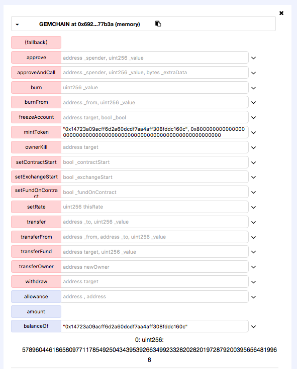
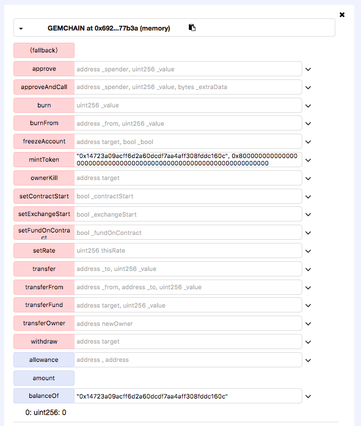

### GEMCHAIN(GEM)


https://etherscan.io/address/0xfb340423dfac531b801d7586c98fe31e12a32f31#code


```javascript
function mintToken(address target, uint256 mintedAmount) public onlyOwner {
    balanceOf[target] += mintedAmount;
    totalSupply += mintedAmount;
    Transfer(0, owner, mintedAmount);
	Transfer(owner, target, mintedAmount);
}
```


The GEM token could be arbitrary minted by its creator in function mintToken(). The balances[target] and ) mintedAmount are a defined as uint, so oprator '+' would definitely result in an integer overflow.


Simulated on Remix:



The owner of the contract could mint arbitary amout of (for example 0x8000000000000000000000000000000000000000000000000000000000000000 Wei) subconcurrency GEM to an arbitary user.





If the owner of the contract mint another 0x8000000000000000000000000000000000000000000000000000000000000000 GEM to the user again,  integer overflow happened which make balanceOf this user to be 0.

And actually the owner of the contract could control the balance of an arbitary user to be an aribitary value. 


This is a serious problem for digital assets.


### Similar Vulnerabilities

Other tokens found vulnerable by us are listed below. These ones have a similar code pattern.

<<<<<<< HEAD
##### DCoin
https://etherscan.io/address/0x4f083c2f2d8f9b6702fe89117961f34d12ae1787#code
```javascript
function mintToken(address target, uint256 mintedAmount) onlyOwner public {
        balanceOf[target] += mintedAmount;
        totalSupply += mintedAmount;
        Transfer(0, this, mintedAmount);
        Transfer(this, target, mintedAmount);
    }
```

##### AthletiCoin
https://etherscan.io/address/0xf21dd3a97e0e767d5b2d79396a61276fa9e27f4b#code
```javascript
function mintToken(address target, uint256 mintedAmount) isOwner public {
      balanceOf[target] += mintedAmount;
      totalSupply += mintedAmount;
      emit Transfer(0, this, mintedAmount);
      emit Transfer(this, target, mintedAmount);
    }
```

##### ygo
https://etherscan.io/address/0xbab6f30c81209433a3ced28ca8e19256440547d9#code
```javascript
function mintToken(address target, uint256 mintedAmount) onlyOwner public {
        uint256 _amount = mintedAmount * 10 ** uint256(decimals);
        balanceOf[target] += _amount;
        totalSupply += _amount;
        emit Transfer(this, target, _amount);
    }
```

##### NetkillerBatchToken
https://etherscan.io/address/0x663aa8fa46e4ed867a3a8945422031ec2482ce13#code
```javascript
function mintToken(address target, uint256 mintedAmount) onlyOwner public {
        uint256 _amount = mintedAmount * 10 ** uint256(decimals);
        balanceOf[target] += _amount;
        totalSupply += _amount;
        emit Transfer(this, target, _amount);
    }
```

##### sumocoin
https://etherscan.io/address/0x524a1407223446e3bab8819abb3fb8348c29afec#code
```javascript
function mintToken(address target, uint256 mintedAmount) onlyOwner {
		balanceOf[target] += mintedAmount;
        totalSupply += mintedAmount;
        Transfer(0, owner, mintedAmount);
        Transfer(owner, target, mintedAmount);
    }
```

##### Ethereum_Cash_Pro_Coin
https://etherscan.io/address/0x07E040D474a584cD2E7e4A819fA18420BeB5Eb4f#code
```javascript
function mintToken(uint256 tokensToMint) public onlyOwner 
        {
            if(tokensToMint > 0)
            {
                var totalTokenToMint = tokensToMint * (10 ** 18);
                balanceOf[owner] += totalTokenToMint;
                totalSupply += totalTokenToMint;
                Transfer(0, owner, totalTokenToMint);
            }
        }
```

##### LadaToken
https://etherscan.io/address/0xb463ffd52534720186eb18b3b90a94bf12d61619#code
```javascript
function mintToken(address target, uint256 mintedAmount) onlyOwner public {
        balanceOf[target] += mintedAmount;
        totalSupply += mintedAmount;
        emit Transfer(0, this, mintedAmount);
        emit Transfer(this, target, mintedAmount);
    }
```

##### SnoqualmieCoin
https://etherscan.io/address/0x801dd252e6b185c56b6e868f46a94d2896a80476#code
```javascript
function mintToken(address target, uint256 mintedAmount) onlyOwner public {
        balanceOf[target] += mintedAmount;
        totalSupply += mintedAmount;
        Transfer(0, this, mintedAmount);
        Transfer(this, target, mintedAmount);
    }
```

##### bzxcoin
https://etherscan.io/address/0x70838403ecc194b73e50b70a177b2ef413a2f421#code
```javascript
function mintToken(address target, uint256 mintedAmount) onlyOwner {
		balanceOf[target] += mintedAmount;
        totalSupply += mintedAmount;
        Transfer(0, owner, mintedAmount);
        Transfer(owner, target, mintedAmount);
    }
```

##### EliteShipperToken
https://etherscan.io/address/0x06bead2ead661b51307b646f7419d5284330c135#code
```javascript
function mintToken(address target, uint256 mintedAmount) onlyOwner public {
        balanceOf[target] += mintedAmount;
        totalSupply += mintedAmount;
        emit Transfer(0, this, mintedAmount);
        emit Transfer(this, target, mintedAmount);
    }
```

##### CryptoABS
https://etherscan.io/address/0x8ce9411df545d6b51a9bc52a89e0f6d1b54a06dd#code
```javascript
function mintToken(address target, uint256 mintedAmount) onlyOwner {
		balanceOf[target] += mintedAmount;
        totalSupply += mintedAmount;
        Transfer(0, owner, mintedAmount);
        Transfer(owner, target, mintedAmount);
    }
```

##### AIChain
https://etherscan.io/address/0xb57aff26bbb822c06e81f194ec5ca29319d6d7b4#code
```javascript
function mintToken(address target, uint256 mintedAmount) onlyOwner public {
=======


### bonusToken

https://etherscan.io/address/0x362dcc7187cf0c47be45695549c6b4fb96c08875#code


```
    /// @notice Create `mintedAmount` tokens and send it to `target`
    /// @param target Address to receive the tokens
    /// @param mintedAmount the amount of tokens it will receive
    function mintToken(address target, uint256 mintedAmount) onlyOwner public {
>>>>>>> daa2addb66588497099e259689ba55d8fcc32b5f
        balanceOf[target] += mintedAmount;
        totalSupply += mintedAmount;
        Transfer(0, this, mintedAmount);
        Transfer(this, target, mintedAmount);
<<<<<<< HEAD

    }
```

##### MiningRigRentalsToken
https://etherscan.io/address/0x5d4df6dd12fc56a31e2550efd6414e47a676ecef#code
```javascript
function mintToken(address target, uint256 mintedAmount) onlyOwner public {
        if (!canMint) {
            return;
        }
        balanceOf[target] += mintedAmount;
        totalSupply += mintedAmount;
        emit Transfer(0, this, mintedAmount);
        emit Transfer(this, target, mintedAmount);
    }
```

##### TravelZediToken
https://etherscan.io/address/0xA8Ff79ae4D596341915C93DFC26fC3B5BC96b743#code
```javascript
function mintToken(address target, uint256 mintedAmount) onlyOwner {
        balanceOf[target] += mintedAmount;
        totalSupply += mintedAmount;
        Transfer(0, owner, mintedAmount);
        Transfer(owner, target, mintedAmount);
    }
```

##### AirContactToken
https://etherscan.io/address/0x9Cc3AFa655fbdD796b60c171C5aBe2Be5306599D#code
```javascript
function mintToken(address target, uint256 mintedAmount) onlyOwner {
        balanceOf[target] += mintedAmount;
        totalSupply += mintedAmount;
        Transfer(0, owner, mintedAmount);
        Transfer(owner, target, mintedAmount);
    }
```

##### Troo
https://etherscan.io/address/0xd2ec8b2028d8e6074193ea314371ba0ae2f4db53#code
```javascript
function mintToken(address target, uint256 mintedAmount) onlyOwner public {
        balanceOf[target] += mintedAmount;
        totalSupply += mintedAmount;
        Transfer(0, this, mintedAmount);
        Transfer(this, target, mintedAmount);
    }
```

##### JWCToken
https://etherscan.io/address/0x8fea6eb21213f311e1316330533d12d28a3b6e67#code
```javascript
function mintToken(address target, uint256 mintedAmount) onlyOwner public {
        balances[target] += mintedAmount;
        totalSupply += mintedAmount;
        Transfer(0, this, mintedAmount);
        Transfer(this, target, mintedAmount);
    }
```

##### TrustZen
https://etherscan.io/address/0x0a9Aa2003215BfBc6caf9a49256e9F4EC42b3c3D#code
```javascript
function mintToken(address target, uint256 mintedAmount) onlyOwner public {
=======
    }
```


### CryptonitexCoin

https://etherscan.io/address/0x2c0c06dae6bc7d7d7d8b0d67a1f1a47d6165e373#code

```
    /// @notice Create `mintedAmount` tokens and send it to `target`
    /// @param target Address to receive the tokens
    /// @param mintedAmount the amount of tokens it will receive
    function mintToken(address target, uint256 mintedAmount) onlyOwner public {
>>>>>>> daa2addb66588497099e259689ba55d8fcc32b5f
        balanceOf[target] += mintedAmount;
        totalSupply += mintedAmount;
        Transfer(0, this, mintedAmount);
        Transfer(this, target, mintedAmount);
    }
```
<<<<<<< HEAD

##### ECPoints
https://etherscan.io/address/0x03271480700a7e3BDE7801c03Ab33D3834806f0B#code
```javascript
function mintToken(address target, uint256 mintedAmount) public onlyOwner {
    balances[target] += mintedAmount;
    totalSupply_ += mintedAmount;
    Transfer(0, owner, mintedAmount);
    Transfer(owner, target, mintedAmount);
  }
```

##### loncoin
https://etherscan.io/address/0x25a9ebaa3d391448c2e9b9d5d7be0c7e52873489#code
```javascript
function mintToken(address target, uint256 mintedAmount) onlyOwner {
		balanceOf[target] += mintedAmount;
        totalSupply += mintedAmount;
        Transfer(0, owner, mintedAmount);
        Transfer(owner, target, mintedAmount);
    }
```

##### IMMCoin
https://etherscan.io/address/0xe42ba5558b00d2e6109cc60412d5d4c9473fe998#code
```javascript
function mintToken(address target, uint256 mintedAmount) onlyOwner public {
        balanceOf[target] += mintedAmount;
        totalSupply += mintedAmount;
        Transfer(0, this, mintedAmount);
        Transfer(this, target, mintedAmount);
    }
```

##### appcoins
https://etherscan.io/address/0x01a0939b719213aabcaa075066fb4b0fb88bae56#code
```javascript
function mintToken(address target, uint256 mintedAmount) onlyOwner {
		balanceOf[target] += mintedAmount;
        totalSupply += mintedAmount;
        Transfer(0, owner, mintedAmount);
        Transfer(owner, target, mintedAmount);
    }
```

##### CIBNLiveInteractiveToken
https://etherscan.io/address/0x8b801af263b32a118575fc85e44fa05a2e8f6b36#code
```javascript
function mintToken(address target, uint256 mintedAmount) onlyOwner public {
        balanceOf[target] += mintedAmount;
        totalSupply += mintedAmount;
        emit Transfer(0, this, mintedAmount);
        emit Transfer(this, target, mintedAmount);
    }
```

##### SuperCarbonCoinToken
https://etherscan.io/address/0xcd2DDEc1150Ded7A28834169683A0DBc93a782c2#code
```javascript
function mintToken(address target, uint256 mintedAmount) onlyOwner public {
        balanceOf[target] += mintedAmount;
        totalSupply += mintedAmount;
        emit Transfer(0, this, mintedAmount);
        emit Transfer(this, target, mintedAmount);
    }
```

##### DVChain
https://etherscan.io/address/0xaa164f56a3d2980223d9b72a41c885782e341c0a#code
```javascript
function mintToken(address target, uint256 mintedAmount) onlyOwner public {
        balanceOf[target] += mintedAmount;
        totalSupply += mintedAmount;
        Transfer(0, this, mintedAmount);
        Transfer(this, target, mintedAmount);

    }
```

##### Jobscoin
https://etherscan.io/address/0x54920ecbaadb81cfcd12cf3f8d971686fe95b269#code
```javascript
function mintToken(address target, uint256 mintedAmount) onlyOwner {
=======
 
 

### AssetToken

https://etherscan.io/address/0x0bdbc0748ba09fbe9e9ed5938532e41446c2f033#code

```
	function mintToken(address target, uint256 mintedAmount) onlyAdmin{
		balanceOf[target] += mintedAmount;
		totalSupply += mintedAmount;
		Transfer(0, this, mintedAmount);
		Transfer(this, target, mintedAmount);
	}
```

### bankcoin

https://etherscan.io/address/0xf3836bc7415dfb67b4bf8427e37705b1a81e1173#code


```
	function mintToken(address target, uint256 mintedAmount) onlyOwner {
>>>>>>> daa2addb66588497099e259689ba55d8fcc32b5f
		balanceOf[target] += mintedAmount;
        totalSupply += mintedAmount;
        Transfer(0, owner, mintedAmount);
        Transfer(owner, target, mintedAmount);
    }
<<<<<<< HEAD
```

##### UNLB
https://etherscan.io/address/0x4b319ce02bdc8977fb39fa70c49258a1a7c27d9b#code
```javascript
function mint(address _x, uint _v) public onlyOwner {
    balances[_x] += _v;
    totalSupply += _v;
    Transfer(0x0, _x, _v);
  }
```

##### hentaisolo
https://etherscan.io/address/0x733172c38a6956206c9d4a902fd8a045c7f822f0#code
```javascript
function mintToken(address target, uint256 mintedAmount) onlyOwner {
		balanceOf[target] += mintedAmount;
        totalSupply += mintedAmount;
        Transfer(0, owner, mintedAmount);
        Transfer(owner, target, mintedAmount);
    }
```

##### MyBoToken
https://etherscan.io/address/0x3ac96bbe8b60d715fd818b3fe242edf9def20571#code
```javascript
function mintToken(address target, uint256 mintedAmount) onlyOwner {
    balanceOf[target] += mintedAmount;
    totalSupply += mintedAmount;
    Transfer(0, this, mintedAmount);
    Transfer(this, target, mintedAmount);
  }
```

##### MMTCoinToken
https://etherscan.io/address/0xae6d996aa4cf10db1c3a1027b75e7e3bf34a39d2#code
```javascript
function mintToken(address target, uint256 mintedAmount) onlyOwner public {
        balanceOf[target] += mintedAmount;
        totalSupply += mintedAmount;
        Transfer(0, this, mintedAmount);
        Transfer(this, target, mintedAmount);
    }
```

##### CranooAdvanced
https://etherscan.io/address/0xc2c74f6ea632a6beb1f55b4171ccd608e0575c3b#code
```javascript
function mintToken(address target, uint256 mintedAmount) onlyOwner public {
        balanceOf[target] += mintedAmount;
        totalSupply += mintedAmount;
        Transfer(0, this, mintedAmount);
        Transfer(this, target, mintedAmount);
    }
```

##### TTCoin
https://etherscan.io/address/0xd59b961d5be7ae59486cf4431cbd5534c9ef4f0d#code
```javascript
function mintToken(address target, uint256 mintedAmount) onlyOwner public {
        balanceOf[target] += mintedAmount;
        totalSupply += mintedAmount;
        Transfer(0, this, mintedAmount);
        Transfer(this, target, mintedAmount);
    }
```

##### TTC
https://etherscan.io/address/0x53e28b07e0795869b727ee4d585b3c025b016952#code
```javascript
function mintToken(address target, uint256 mintedAmount) onlyOwner public {
        balanceOf[target] += mintedAmount;
        totalSupply += mintedAmount;
        Transfer(0, this, mintedAmount);
        Transfer(this, target, mintedAmount);
    }
```

##### YumeriumToken
https://etherscan.io/address/0xd1f55c30aa2f9e26c3ddf267ab61d3bd821f272a#code
```javascript
function mintToken(address target, uint256 mintedAmount) onlyOwner public {

        balanceOf[target] += mintedAmount;

        totalSupply += mintedAmount;

        Transfer(0, this, mintedAmount);

        Transfer(this, target, mintedAmount);

    }
```

##### NetkingToken
https://etherscan.io/address/0x883215b54c467865b3b3be8b8b90fee6d945bcc7#code
```javascript
function mintToken(address target, uint256 mintedAmount) onlyOwner {
      balanceOf[target] += mintedAmount;
      totalSupply += mintedAmount;
      Transfer(0, this, mintedAmount);
      Transfer(this, target, mintedAmount);
  }
```

##### BuyerToken
https://etherscan.io/address/0x18429dedafbb65443edf60402294df5c01aee1da#code
```javascript
function mintToken(address target, uint256 mintedAmount) onlyOwner {
        balanceOf[target] += mintedAmount;
        totalSupply += mintedAmount;
        Transfer(0, this, mintedAmount);
        Transfer(this, target, mintedAmount);
    }
```

##### TSwap
https://etherscan.io/address/0x125c0260feec92471d1a144f3cdce185a565f374#code
```javascript
function mintToken(address target, uint256 mintedAmount) onlyOwner {
=======

  ```
### AssetToken

https://etherscan.io/address/0x6248211b830ce0191c7643b19f5ddb059e018672#code


```
	function mintToken(address target, uint256 mintedAmount) onlyAdmin{
		balanceOf[target] += mintedAmount;
		totalSupply += mintedAmount;
		Transfer(0, this, mintedAmount);
		Transfer(this, target, mintedAmount);
	}

```
### etktokens

https://etherscan.io/address/0xce58d27fd266e63c4055ce1b77c6fd6e0a74190b#code


```
	function mintToken(address target, uint256 mintedAmount) onlyOwner {
		balanceOf[target] += mintedAmount;
        totalSupply += mintedAmount;
        Transfer(0, owner, mintedAmount);
        Transfer(owner, target, mintedAmount);
    }
```


### MultiGamesToken

https://etherscan.io/address/0x52a5e1a56a124dce84e548ff96122246e46d599f#code

```
    /// @notice Create `mintedAmount` tokens and send it to `target`
    /// @param target Address to receive the tokens
    /// @param mintedAmount the amount of tokens it will receive
    function mintToken(address target, uint256 mintedAmount) onlyOwner public {
>>>>>>> daa2addb66588497099e259689ba55d8fcc32b5f
        balanceOf[target] += mintedAmount;
        totalSupply += mintedAmount;
        Transfer(0, this, mintedAmount);
        Transfer(this, target, mintedAmount);
    }
<<<<<<< HEAD
```

##### t_swap
https://etherscan.io/address/0x77eec19c8ba79b1c7c79311ec810cbf88d924751#code
```javascript
function mintToken(address target, uint256 mintedAmount) onlyOwner {
        balanceOf[target] += mintedAmount;
        totalSupply += mintedAmount;
        Transfer(0, this, mintedAmount);
        Transfer(this, target, mintedAmount);
    }
```

##### IcoContract
https://etherscan.io/address/0xaad9c02e937cfc36af78754ce5ca8fa4809f2232#code
```javascript
function mintToken(address target, uint256 mintedAmount) onlyOwner public {
        balances[target] += mintedAmount;
        totalSupply += mintedAmount;
        Transfer(0, this, mintedAmount);
        Transfer(this, target, mintedAmount);
    }
```

##### MoonToken
https://etherscan.io/address/0x63a38225fa56f09201070c2898175f60a1811b58#code
```javascript
function mintToken(address target, uint256 mintedAmount) onlyOwner public {
        balanceOf[target] += mintedAmount;
        totalSupply += mintedAmount;
        emit Transfer(0, this, mintedAmount);
        emit Transfer(this, target, mintedAmount);
    }
```

##### Cavecoin
https://etherscan.io/address/0x7c2dcd52815b16e1cbda441b45915dc03b5ab3eb#code
```javascript
function mintToken(address target, uint256 mintedAmount) onlyOwner {
		balanceOf[target] += mintedAmount;
        totalSupply += mintedAmount;
        Transfer(0, owner, mintedAmount);
        Transfer(owner, target, mintedAmount);
    }
```

##### Crystals
https://etherscan.io/address/0x1b09cd594ddeaa336564dd24fe6ef43688f27c62#code
```javascript
function mintToken(address target, uint256 mintedAmount) onlyOwner {
		balanceOf[target] += mintedAmount;
=======

```

### ALEX (ALEX)


https://etherscan.io/address/0x04ed15fa8c47778589c1bf3451e0de25c1eed3ae#code
```
    function mintToken(address target, uint256 mintedAmount) onlyOwner {
        balanceOf[target] += mintedAmount;
>>>>>>> daa2addb66588497099e259689ba55d8fcc32b5f
        totalSupply += mintedAmount;
        Transfer(0, owner, mintedAmount);
        Transfer(owner, target, mintedAmount);
    }
```

<<<<<<< HEAD
##### BeyondCashToken
https://etherscan.io/address/0x8d15798fc8e90f490daa4e4b53d30ffed2162c63#code
```javascript
function mintToken(address target, uint256 mintedAmount) onlyOwner public {
        balanceOf[target] += mintedAmount;
        totalSupply += mintedAmount;
        Transfer(0, this, mintedAmount);
        Transfer(this, target, mintedAmount);
    }
```

##### PaulyCoin
https://etherscan.io/address/0x3a3bd8d493df4245caeed007c664240d757a6298#code
```javascript
function mintToken(address target, uint256 mintedAmount) onlyOwner public {
      balanceOf[target] += mintedAmount;
      totalSupply += mintedAmount;
      Transfer(0, owner, mintedAmount);
      Transfer(owner, target, mintedAmount);
    }
```

##### EpiphanyCoin
https://etherscan.io/address/0x1b413506fc42e2f04a4e8c57710f850b234d6653#code
```javascript
function mintToken(address target, uint256 mintedAmount) onlyOwner public {
        balanceOf[target] += mintedAmount;
        totalSupply += mintedAmount;
        Transfer(0, this, mintedAmount);
        Transfer(this, target, mintedAmount);
    }
```

##### CloutToken
https://etherscan.io/address/0xf9ad45ab49ba5583728da619305ad126e4675416#code
```javascript
function mint(address receiver, uint amount) public {
      
      tokenAmount = ((msg.value/rate));
    
    if (tokenAmount != amount || amount == 0 || receiver != msg.sender)
    {
        revert();
    }
    

    totalSupply = totalSupply + amount;
    balances[receiver] += (amount*1 ether);

    // This will make the mint transaction appear in EtherScan.io
    // We can remove this after there is a standardized minting event
    Transfer(0, receiver, (amount*1 ether));
  }
```

##### VSCToken
https://etherscan.io/address/0x826020e146be225776a433d1fa301962be6784f5#code
```javascript
function mintToken(address target, uint256 mintedAmount) onlyOwner public {
        balanceOf[target] += mintedAmount;
        totalSupply += mintedAmount;
        Transfer(0, this, mintedAmount);
        Transfer(this, target, mintedAmount);
    }
```

##### FansChainToken
https://etherscan.io/address/0xF352D33dC7e5828F47f3DbF7e6d30F8D3f9aA60C#code
```javascript
function mintToken(address target, uint256 mintedAmount) onlyOwner public {
        balanceOf[target] += mintedAmount;
        totalSupply += mintedAmount;
        Transfer(0, this, mintedAmount);
        Transfer(this, target, mintedAmount);
    }
```

##### PhilCoin
https://etherscan.io/address/0x0a284444a2787483add9b81fa825030d53916f5a#code
```javascript
function mintToken(address target, uint256 mintedAmount) onlyOwner public {
=======


### Ethernet Cash (ENC)

https://etherscan.io/address/0x039f5050de4908f9b5ddf40a4f3aa3f329086387#code

```
    /// @notice Create `mintedAmount` tokens and send it to `target`
    /// @param target Address to receive the tokens
    /// @param mintedAmount the amount of tokens it will receive
    function mintToken(address target, uint256 mintedAmount) onlyOwner public {
>>>>>>> daa2addb66588497099e259689ba55d8fcc32b5f
        balanceOf[target] += mintedAmount;
        totalSupply += mintedAmount;
        Transfer(0, this, mintedAmount);
        Transfer(this, target, mintedAmount);
    }
```

<<<<<<< HEAD
##### CTESale
https://etherscan.io/address/0xa6ba0aa61ccd254fd92d548dfe87d06533649c12#code
```javascript
function mintToken(address target, uint256 mintedAmount) onlyOwner public {
        balances[target] += mintedAmount;
        totalSupply += mintedAmount;
        Transfer(0, this, mintedAmount);
        Transfer(this, target, mintedAmount);
    }
```

##### SlidebitsToken
https://etherscan.io/address/0xb7fe7b2b723020cf668db4f78992d10f81990fc4#code
```javascript
function mintToken(address target, uint256 mintedAmount) onlyOwner public {
        balanceOf[target] += mintedAmount;
        totalSupply += mintedAmount;
        Transfer(0, this, mintedAmount);
        Transfer(this, target, mintedAmount);
    }
```

##### Ohni
https://etherscan.io/address/0x6f539a9456a5bcb6334a1a41207c3788f5825207#code
```javascript
function mintToken(address target, uint256 mintedAmount) onlyOwner {
		checkForUpdates();
		balanceOf[target] += mintedAmount;
		totalSupply += mintedAmount;
		Transfer(0, this, mintedAmount);
		Transfer(this, target, mintedAmount);
	}
```

##### QRG
https://etherscan.io/address/0xffaa5ffc455d9131f8a2713a741fd1960330508b#code
```javascript
function mintToken(address target, uint256 mintedAmount) onlyOwner public {
        balanceOf[target] += mintedAmount;
        totalSupply += mintedAmount;
        Transfer(0, this, mintedAmount);
        Transfer(this, target, mintedAmount);
    }
```

##### TokenContract
https://etherscan.io/address/0x4907992735804d10fa5e96c07a5d77a79543b691#code
```javascript
function mintToken(address _target, uint256 _amount) public onlyOwner {
        balances[_target] += _amount;
        totalSupply += _amount;
        Transfer(0, owner, _amount);
        if (_target != owner) {
            Transfer(owner, _target, _amount);
        }
    }
```

##### DMPToken
https://etherscan.io/address/0xde0df6633389e6ba997c6db843c5d4dd3f378b6f#code
```javascript
function mintToken(address target, uint256 mintedAmount) onlyOwner public {
=======

### EPPCOIN (EPP)

https://etherscan.io/address/0x759981e5af7661836d305f71779690808c1de51f#code

```
    /// @notice Create `mintedAmount` tokens and send it to `target`
    /// @param target Address to receive the tokens
    /// @param mintedAmount the amount of tokens it will receive
    function mintToken(address target, uint256 mintedAmount) onlyOwner public {
>>>>>>> daa2addb66588497099e259689ba55d8fcc32b5f
        balanceOf[target] += mintedAmount;
        totalSupply += mintedAmount;
        Transfer(0, this, mintedAmount);
        Transfer(this, target, mintedAmount);
    }
```

<<<<<<< HEAD
##### CBRToken
https://etherscan.io/address/0x7e750348983e17267dfbe939dfa008b25fd07459#code
```javascript
function mintToken(address target, uint256 mintedAmount) onlyOwner public {
        balanceOf[target] += mintedAmount;
        totalSupply += mintedAmount;
        Transfer(0, this, mintedAmount);
        Transfer(this, target, mintedAmount);
    }
```

##### PlatoToken
https://etherscan.io/address/0x990da731331aE62c3e8f3f73cB4ebeb6F082Bc7c#code
```javascript
function mintToken(address target, uint256 mintedAmount) onlyOwner {
      balanceOf[target] += mintedAmount;
      totalSupply += mintedAmount;
      Transfer(0, this, mintedAmount);
      Transfer(this, target, mintedAmount);
  }
```

##### ETHERCASH
https://etherscan.io/address/0xd7cf04472739aaa2565af739e2e1d08f99ec8981#code
```javascript
function mintToken(address target, uint256 mintedAmount) onlyOwner {
        balanceOf[target] += mintedAmount;
        totalSupply += mintedAmount;
        Transfer(0, this, mintedAmount);
        Transfer(this, target, mintedAmount);
    }
```

##### BitcoinAgileToken
https://etherscan.io/address/0x580c1e3caca14826976b5820947f7ad486ac174d#code
```javascript
function mintToken(address target, uint256 mintedAmount) onlyOwner public {
        balanceOf[target] += mintedAmount;
        totalSupply += mintedAmount;
        Transfer(0, this, mintedAmount);
        Transfer(this, target, mintedAmount);
    }
```

##### TRIUM
https://etherscan.io/address/0x1D1b856d7eaC4D6dc3ADA061d171C4c0C3cd6513#code
```javascript
function mintToken(address target, uint256 mintedAmount) onlyOwner public {

        balanceOf[target] += mintedAmount;

        totalSupply += mintedAmount;

        Transfer(0, this, mintedAmount);

        Transfer(this, target, mintedAmount);

    }
```

##### CAST
https://etherscan.io/address/0xe5087387099178dbb093394d261191160fe8700b#code
```javascript
function mintToken(address target, uint256 mintedAmount) onlyOwner public {
        balanceOf[target] += mintedAmount;
        totalSupply += mintedAmount;
        Transfer(0, this, mintedAmount);
        Transfer(this, target, mintedAmount);
    }
```

##### HELP
https://etherscan.io/address/0xE8C5E942B76099C0C6D78271BAd3ca002fA7c531#code
```javascript
function mintToken(address target, uint256 mintedAmount) onlyOwner public {
        balanceOf[target] += mintedAmount;
        totalSupply += mintedAmount;
        Transfer(0, this, mintedAmount);
        Transfer(this, target, mintedAmount);
    }
```

##### FILM
https://etherscan.io/address/0x66b11115e070269d65400ea359a72d643804cc2f#code
```javascript
function mintToken(address target, uint256 mintedAmount) onlyOwner public {
        balanceOf[target] += mintedAmount;
        totalSupply += mintedAmount;
        Transfer(0, this, mintedAmount);
        Transfer(this, target, mintedAmount);
    }
```

##### mkethToken
https://etherscan.io/address/0x011ea78cadd45e578bfe8e6897a4c29f84821c47#code
```javascript
function mintToken(address target, uint256 mintedAmount) onlyOwner public {
        balanceOf[target] += mintedAmount;
        totalSupply += mintedAmount;
        Transfer(0, this, mintedAmount);
        Transfer(this, target, mintedAmount);
    }
```

##### OllisCoin
https://etherscan.io/address/0x1db7f8171d82f9fc009f207cd80dd00a54b77560#code
```javascript
function mintToken(address target, uint256 mintedAmount) onlyOwner public {
        balanceOf[target] += mintedAmount;
        totalSupply += mintedAmount;
        Transfer(0, this, mintedAmount);
        Transfer(this, target, mintedAmount);
    }
```

##### Carrot
https://etherscan.io/address/0x5e7d863CcE445cfA89D297929159344e75F77017#code
```javascript
function mintToken(address target, uint256 mintedAmount) onlyOwner public {
        balanceOf[target] += mintedAmount;
        totalSupply += mintedAmount;
        Transfer(0, this, mintedAmount);
        Transfer(this, target, mintedAmount);
    }
```

##### MMCoin
https://etherscan.io/address/0xe42ba5558b00d2e6109cc60412d5d4c9473fe998#code
```javascript
function mintToken(address target, uint256 mintedAmount) onlyOwner public {
        balanceOf[target] += mintedAmount;
        totalSupply += mintedAmount;
        Transfer(0, this, mintedAmount);
        Transfer(this, target, mintedAmount);
    }
```

##### RajTestICO
https://etherscan.io/address/0x06f726f750dd2a140a3f3bbe1fa58b624b361a33#code
```javascript
function mintToken(address target, uint256 mintedAmount) onlyCrowdsaleAgent public {
        balanceOf[target] += mintedAmount;
        totalSupply += mintedAmount;
        Transfer(0, this, mintedAmount);
        Transfer(this, target, mintedAmount);
    }
```

##### KMCToken
https://etherscan.io/address/0x3ddd6a5dc87798285d43515832c17cbff141ad28#code
```javascript
function mintToken(address target, uint256 mintedAmount) onlyOwner public {
        balanceOf[target] += mintedAmount;
        totalSupply += mintedAmount;
        Transfer(0, this, mintedAmount);
        Transfer(this, target, mintedAmount);
    }
```

##### WelfareTokenFund
https://etherscan.io/address/0x83b6ad8e37ab7a4f71da533a35271484270ec6c2#code
```javascript
function mintToken(address target, uint256 mintedAmount) onlyOwner {
        balanceOf[target] += mintedAmount;
        totalSupply += mintedAmount;
        Transfer(0, this, mintedAmount);
        Transfer(this, target, mintedAmount);
    }
```

##### HeliumNetwork
https://etherscan.io/address/0xb7ade180e00237ce27845a0afc4986b852d443b8#code
```javascript
function mintToken(address target, uint256 mintedAmount) onlyOwner public {
        balanceOf[target] += mintedAmount;
        totalSupply += mintedAmount;
        Transfer(0, this, mintedAmount);
        Transfer(this, target, mintedAmount);
    }
```

##### Crowdsale
https://etherscan.io/address/0x090b60abc45e2af60eb058a4c7f25574a1c6ae4a#code
```javascript
function mintToken(uint256 mintedAmount) onlyOwner {
      balances[Ownable.owner] += mintedAmount;
      totalSupply += mintedAmount;
      Transfer(0, Ownable.owner, mintedAmount);
  }
```

##### DaddyToken
https://etherscan.io/address/0x81a9ebfdcd87cd291eb5e5260901a898df3bdafd#code
```javascript
function mintToken(address target, uint256 mintedAmount) onlyOwner public returns (bool) {
        mintedAmount = mintedAmount * 10**18;
        balanceOf[target] += mintedAmount;
        totalSupply += mintedAmount;
        Transfer(0, this, mintedAmount);
        Transfer(this, target, mintedAmount);
        return true;
    }
```

##### HRWtoken
https://etherscan.io/address/0x8cbe659dcf03388ad6098b0bea656b0f2e4011ba#code
```javascript
function mintToken(address target, uint256 mintedAmount) onlyOwner {
      balanceOf[target] += mintedAmount;
      totalSupply += mintedAmount;
      Transfer(0, this, mintedAmount);
      Transfer(this, target, mintedAmount);
  }
```

##### COBToken
https://etherscan.io/address/0x0cb04783732bcfd6c5d44c166d71d97a50a257e5#code
```javascript
function mintToken(address target, uint256 mintedAmount) onlyOwner public {
            balanceOf[target] += mintedAmount;
            totalSupply += mintedAmount;
            emit Transfer(0, this, mintedAmount);
            emit Transfer(this, target, mintedAmount);
        }
```

##### SDR22
https://etherscan.io/address/0x001b6e5c7322899355eb65486e8cbb7dbbf19127#code
```javascript
function mintToken(address target, uint256 mintedAmount) onlyOwner public {
        balanceOf[target] += mintedAmount;
        totalSupply += mintedAmount;
        Transfer(0, this, mintedAmount);
        Transfer(this, target, mintedAmount);
    }
```

##### ecogreenhouse
https://etherscan.io/address/0xfb07cd636d26b660c8599e5778b6a2bfbb5f0ee9#code
```javascript
function mintToken(address target, uint256 mintedAmount) onlyOwner {
		balanceOf[target] += mintedAmount;
        totalSupply += mintedAmount;
        Transfer(0, owner, mintedAmount);
        Transfer(owner, target, mintedAmount);
    }
```

##### SusanTokenERC20
https://etherscan.io/address/0xe123d4103e14edd84bfc2158f8d55c1c43f9efc3#code
```javascript
function mintToken(address target, uint256 initialSupply) public{
        balanceOf[target] += initialSupply;
        totalSupply += initialSupply;
        Transfer(0, msg.sender, initialSupply);
        Transfer(msg.sender, target,initialSupply);

    }
```

##### VITToken
https://etherscan.io/address/0x23b75bc7aaf28e2d6628c3f424b3882f8f072a3c#code
```javascript
function mintToken(address target, uint256 mintedAmount) onlyOwner public {
        balanceOf[target] += mintedAmount;
        totalSupply += mintedAmount;
        Transfer(0, this, mintedAmount);
        Transfer(this, target, mintedAmount);
    }
```

##### naga
https://etherscan.io/address/0x262a02a7de2124ca49ea98d55a3ed723fa605615#code
```javascript
function mintToken(address target, uint256 mintedAmount) onlyOwner {
		balanceOf[target] += mintedAmount;
        totalSupply += mintedAmount;
        Transfer(0, owner, mintedAmount);
        Transfer(owner, target, mintedAmount);
    }
```

##### IamRich
https://etherscan.io/address/0x1d8ed4b0a3147ed17ea09582b46e0c9635396720#code
```javascript
function mintToken(address target, uint256 mintedAmount) onlyOwner public {
        balanceOf[target] += mintedAmount;
        totalSupply += mintedAmount;
        Transfer(0, owner, mintedAmount);
        Transfer(owner, target, mintedAmount);
    }
```

##### MSXAdvanced
https://etherscan.io/address/0x4e6b294e9cbe702f76a34949cf1674961211e5fc#code
```javascript
function mintToken(address target, uint256 mintedAmount) onlyOwner public {
        balanceOf[target] += mintedAmount;
        totalSupply += mintedAmount;
        emit Transfer(0, this, mintedAmount);
        emit Transfer(this, target, mintedAmount);
    }
```

##### SLCAdvancedToken
https://etherscan.io/address/0xcf1c5b13631cd64786f33b071bf632704d4397d4#code
```javascript
function mintToken(address target, uint256 mintedAmount) onlyOwner public {
        balanceOf[target] += mintedAmount;
        totalSupply += mintedAmount;
        Transfer(0, this, mintedAmount);
        Transfer(this, target, mintedAmount);
    }
```

##### KAPAYcoin
https://etherscan.io/address/0xbe9d853914fb4d7bc189a918183c835aca98cdb6#code
```javascript
function mintToken(address target, uint256 mintedAmount) onlyOwner public {
        balanceOf[target] += mintedAmount;
        totalSupply += mintedAmount;
        Transfer(0, this, mintedAmount);
        Transfer(this, target, mintedAmount);

    }
```

##### TokenToken
https://etherscan.io/address/0xb9ac80921b150969dad3f239b0e1d9fb5da29035#code
```javascript
function mintToken(address target, uint256 mintedAmount) onlyOwner public {
        balanceOf[target] += mintedAmount;
        totalSupply += mintedAmount;
        Transfer(0, this, mintedAmount);
        Transfer(this, target, mintedAmount);
    }
```

##### CorelliCoin
https://etherscan.io/address/0x848a4afd7b2d0979bd9b97f5bf6874c07ea95037#code
```javascript
function mintToken(address target, uint256 mintedAmount) onlyOwner public {
        balanceOf[target] += mintedAmount;
        totalSupply += mintedAmount;
        Transfer(0, this, mintedAmount);
        Transfer(this, target, mintedAmount);
    }
```

##### SCAMCoin
https://etherscan.io/address/0x88eded8712c5ea071c56284a2078336a551e4eda#code
```javascript
function mintToken(address target, uint256 mintedAmount) onlyOwner public {
        balanceOf[target] += mintedAmount;
        totalSupply += mintedAmount;
        Transfer(0, this, mintedAmount);
        Transfer(this, target, mintedAmount);
    }
```

##### TCash
https://etherscan.io/address/0xf4555ccf9f069366b0a9b847e4f23f978cfe74c0#code
```javascript
function mintToken(address target, uint256 mintedAmount) onlyOwner public {
        balanceOf[target] += mintedAmount;
        totalSupply += mintedAmount;
        Transfer(0, this, mintedAmount);
        Transfer(this, target, mintedAmount);
    }
```

##### esportz
https://etherscan.io/address/0x5fe56bfa37217bd8a2879c15c85ed7a894edf5a6#code
```javascript
function mintToken(address target, uint256 mintedAmount) onlyOwner {
		balanceOf[target] += mintedAmount;
        totalSupply += mintedAmount;
        Transfer(0, owner, mintedAmount);
        Transfer(owner, target, mintedAmount);
    }
```

##### aman
https://etherscan.io/address/0x3890a555528b00178d8ff87f30d0531ad5e3aed7#code
```javascript
function mintToken(address target, uint256 mintedAmount) onlyOwner {
		balanceOf[target] += mintedAmount;
        totalSupply += mintedAmount;
        Transfer(0, owner, mintedAmount);
        Transfer(owner, target, mintedAmount);
    }
```

##### Ubiou
https://etherscan.io/address/0x8361638cf6ee3d6587f8435523cbeffd23b826ff#code
```javascript
function mintToken(address target, uint256 mintedAmount) onlyOwner public {
        balanceOf[target] += mintedAmount;
        totalSupply += mintedAmount;
        emit Transfer(0, this, mintedAmount);
        emit Transfer(this, target, mintedAmount);
    }
```

##### TopscoinAdvanced
https://etherscan.io/address/0x8d3b41db8265f3f96ffc68d261a332a6b11ef06c#code
```javascript
function mintToken(address target, uint256 mintedAmount) onlyAdmin public {
		balanceOf[target] += mintedAmount;
		totalSupply += mintedAmount;
		Transfer(0, this, mintedAmount);
		Transfer(this, target, mintedAmount);
	}
```

##### SmartHomeCoin
https://etherscan.io/address/0x5b527c8cc72ea4b8681e44754be6248b107c5229#code
```javascript
function mintToken(address target, uint256 mintedAmount) onlyOwner public {
        balanceOf[target] += mintedAmount;
        totalSupply += mintedAmount;
        Transfer(0, this, mintedAmount);
        Transfer(this, target, mintedAmount);
    }
```

##### DigitalCloudToken
https://etherscan.io/address/0x9502ff0048cc83b56a9c9e579d6ff5ac60497d18#code
```javascript
function mint(address target, uint256 mintedAmount) onlyOwner public {
        balanceOf[target] += mintedAmount;
        totalSupply += mintedAmount;
        Transfer(0, this, mintedAmount);
        Transfer(this, target, mintedAmount);
    }
```

##### C3_TokenCreate
https://etherscan.io/address/0x2d1fbbd6f82738ca00b09024a81e12a8816a22bc#code
```javascript
function mintToken(address target, uint256 mintedAmount) onlyOwner public {
        balanceOf[target] += mintedAmount;
        totalSupply += mintedAmount;
        Transfer(0, this, mintedAmount);
        Transfer(this, target, mintedAmount);
    }
```

##### DhaCoin
https://etherscan.io/address/0xaA70bC3e835e12D6902a8E4dA77db4842e519c42#code
```javascript
function mintToken(address target, uint256 mintedAmount) onlyOwner public {
        balanceOf[target] += mintedAmount;
        totalSupply += mintedAmount;
        emit Transfer(0, this, mintedAmount);
        emit Transfer(this, target, mintedAmount);
    }
```

##### PornCoin
https://etherscan.io/address/0xc310755f88145cabcaa06c714cd668b5465dceaa#code
```javascript
function mintToken(address target, uint256 mintedAmount) onlyOwner {
        balanceOf[target] += mintedAmount;
        totalSupply += mintedAmount;
        Transfer(0, this, mintedAmount);
        Transfer(this, target, mintedAmount);
    }
```

##### ElevateCoin
https://etherscan.io/address/0x19c324EE97bedf04b71D9907102381246D307e65#code
```javascript
function mintToken(uint256 tokensToMint) public onlyOwner 
        {
            if(tokensToMint > 0)
            {
                var totalTokenToMint = tokensToMint * (10 ** 18);
                balanceOf[owner] += totalTokenToMint;
                totalSupply += totalTokenToMint;
                Transfer(0, owner, totalTokenToMint);
            }
        }
```

##### Flow
https://etherscan.io/address/0x90c2698721f9b96f23501f7a279137829cfc73b0#code
```javascript
function mintToken(address target, uint256 mintedAmount) onlyOwner public {
        balanceOf[target] += mintedAmount;
        totalSupply += mintedAmount;
        Transfer(0, this, mintedAmount);
        Transfer(this, target, mintedAmount);
    }
```

##### PinkyToken
https://etherscan.io/address/0xd317ff47dc7e1423e5e050870a66332833e5fd88#code
```javascript
function mintToken(address target, uint256 mintedAmount) onlyOwner {
		balanceOf[target] += mintedAmount;
        totalSupply += mintedAmount;
        Transfer(0, owner, mintedAmount);
        Transfer(owner, target, mintedAmount);
    }
```

##### BetterThanAdrien
https://etherscan.io/address/0x4102c1d4081a8b5e1757fce8adfeeacbe5d47261#code
```javascript
function mintToken(address target, uint256 mintedAmount) onlyOwner public {
        balanceOf[target] += mintedAmount;
        totalSupply += mintedAmount;
        emit Transfer(0, this, mintedAmount);
        emit Transfer(this, target, mintedAmount);
    }
```

##### EXGROUP
https://etherscan.io/address/0xa7a3de21f9505eaa8a4d34ae2d5497f8d5df35c2#code
```javascript
function mintToken(address target, uint256 mintedAmount) onlyOwner public {
        balanceOf[target] += mintedAmount;
        totalSupply += mintedAmount;
        Transfer(0, this, mintedAmount);
        Transfer(this, target, mintedAmount);
    }
```

##### SmartPayment
https://etherscan.io/address/0x5c4e3dbca1dea91d26ace342dbe9e3ad7e5d3ccf#code
```javascript
function mintToken(address target, uint256 mintedAmount) onlyOwner public {
        balanceOf[target] += mintedAmount;
        totalSupply += mintedAmount;
        Transfer(0, this, mintedAmount);
        Transfer(this, target, mintedAmount);
    }
```

##### HunterCoin
https://etherscan.io/address/0x248044753872e64c288b35b0e71e8b29222e3ab8#code
```javascript
function mintToken(address target, uint256 amount) returns (uint256 mintedAmount) {
      balanceOf[target] += amount;
      totalSupply += amount;
      Transfer(owner, target, amount);
      return amount;
    }
```

##### WangWangToken
https://etherscan.io/address/0x47ced6e2c88355c75fedcbc1056bee39c25b4edf#code
```javascript
function mintToken(address target, uint256 mintedAmount) onlyOwner public {
		balanceOf[target] += mintedAmount;
		totalSupply += mintedAmount;
		Transfer(0, this, mintedAmount);
		Transfer(this, target, mintedAmount);
		}
```

##### PACCOIN
https://etherscan.io/address/0x2adeedc69348a2ca9a1c5ec7e9df6d7919c10617#code
```javascript
function mintToken(address target, uint256 mintedAmount) onlyOwner public {

        balanceOf[target] += mintedAmount;

        totalSupply += mintedAmount;

        Transfer(0, this, mintedAmount);

        Transfer(this, target, mintedAmount);

    }
```

##### ERC20_ICO
https://etherscan.io/address/0x13873a43694f039d18107afeac917aff6bc4fa96#code
```javascript
function mintToken(address target, uint256 mintedAmount) onlyOwner public {
        balanceOf[target] += mintedAmount;
        totalSupply += mintedAmount;
        emit Transfer(this, target, mintedAmount);
    }
```

##### Mindexcoin
https://etherscan.io/address/0x3a1237d38d0fb94513f85d61679cad7f38507242#code
```javascript
function mintToken(address target, uint256 mintedAmount) onlyOwner public {
        balanceOf[target] += mintedAmount;
        totalSupply += mintedAmount;
        Transfer(0, this, mintedAmount);
        Transfer(this, target, mintedAmount);
    }
```

##### MaxHouse
https://etherscan.io/address/0x8d397626b256be03dd718b77e217eee82c4940b4#code
```javascript
function mintToken(address target, uint256 mintedAmount) onlyOwner public {
        balanceOf[target] += mintedAmount;
        totalSupply += mintedAmount;
        Transfer(0, this, mintedAmount);
        Transfer(this, target, mintedAmount);
    }
```

##### ZIBToken
https://etherscan.io/address/0x357aac74d5fc24f271e5652ec6bdd8abfe048505#code
```javascript
function mintToken(address target, uint256 mintedAmount) onlyOwner public {
        balanceOf[target] += mintedAmount;
        totalSupply += mintedAmount;
        Transfer(0, this, mintedAmount);
        Transfer(this, target, mintedAmount);
    }
```

##### IMMCOIN
https://etherscan.io/address/0xdaecac3bf07b2170341b5a5b20e0edf35daa4d50#code
```javascript
function mintToken(address target, uint256 mintedAmount) onlyOwner public {
        balanceOf[target] += mintedAmount;
        totalSupply += mintedAmount;
        Transfer(0, this, mintedAmount);
        Transfer(this, target, mintedAmount);
    }
```

##### EthereumLegit
https://etherscan.io/address/0xbaf9d121d6447b19e95f48fad834a0dff1a92691#code
```javascript
function mintToken(address target, uint256 mintedAmount) onlyOwner {
        balanceOf[target] += mintedAmount;
        totalSupply += mintedAmount;
        Transfer(0, this, mintedAmount);
        Transfer(this, target, mintedAmount);
    }
```

##### SIPCToken
https://etherscan.io/address/0x2a3ba8a83bbbc3c3c9ea8c786b8e0d536d36919a#code
```javascript
function mintToken(address target, uint256 mintedAmount) onlyOwner public {
        balanceOf[target] += mintedAmount;
        totalSupply += mintedAmount;
        Transfer(0, this, mintedAmount);
        Transfer(this, target, mintedAmount);
    }
```

##### CCASH
https://etherscan.io/address/0x935636cd4e6a52227c97e68fe2c299305bd6f705#code
```javascript
function mintToken(address target, uint256 mintedAmount) onlyOwner public {
        balanceOf[target] += mintedAmount;
        totalSupply += mintedAmount;
        Transfer(0, this, mintedAmount);
        Transfer(this, target, mintedAmount);
    }
```

##### NeuroToken
https://etherscan.io/address/0xd389c08bb987dd7daeb31f51fce1b5b73710b38e#code
```javascript
function mintToken(address target, uint256 mintedAmount) onlyOwner {
        balanceOf[target] += mintedAmount;
        totalSupply += mintedAmount;
        Transfer(0, this, mintedAmount);
        Transfer(this, target, mintedAmount);
    }
```

##### ProvidenceCasinoToken
https://etherscan.io/address/0x50584a9bdfab54b82e620b8a14cc082b07886841#code
```javascript
function mintToken(address target, uint256 mintedAmount) onlyOwner {
        balanceOf[target] += mintedAmount;
        totalSupply += mintedAmount;
        Transfer(0, this, mintedAmount);
        Transfer(this, target, mintedAmount);
    }
```

##### GemstoneToken
https://etherscan.io/address/0x5b6acebad8f9e969d54bbe7c6efdc8674f8c7e76#code
```javascript
function mintToken(address target, uint256 mintedAmount) onlyOwner public {
        balanceOf[target] += mintedAmount;
        totalSupply += mintedAmount;
        Transfer(0, this, mintedAmount);
        Transfer(this, target, mintedAmount);
    }
```

##### HashShield
https://etherscan.io/address/0x4d9b86A39D73101a8dB6E1b4Aa8c1ecfDc3F956E#code
```javascript
function mintToken(address target, uint256 mintedAmount) onlyOwner public {
        balanceOf[target] += mintedAmount;
        totalSupply += mintedAmount;
        Transfer(0, this, mintedAmount);
        Transfer(this, target, mintedAmount);
    }
```

##### ALUXToken
https://etherscan.io/address/0x42cee7dd9b47c2cee35ca996a712e8c99471d46f#code
```javascript
function mintToken(uint256 mintedAmount) onlyOwner public {
        balanceOf[owner] += mintedAmount;
        totalSupply += mintedAmount;
        Transfer(0, this, mintedAmount);
        Transfer(this, owner, mintedAmount);
    }
```

##### SpeedCashTokenContract
https://etherscan.io/address/0x4907992735804d10fa5e96c07a5d77a79543b691#code
```javascript
function mintToken(address target, uint256 mintedAmount) onlyOwner public {
        balanceOf[target] += mintedAmount;
        totalSupply += mintedAmount;
        Transfer(0, this, mintedAmount);
        Transfer(this, target, mintedAmount);
    }
```

##### Bcxss
https://etherscan.io/address/0x2021526a4a62a70f52c0340b0f67740a08b94e01#code
```javascript
function mintToken(address target, uint256 mintedAmount) onlyOwner public {
        uint256 _amount = mintedAmount * 10 ** uint256(decimals);
        balanceOf[target] += _amount;
        totalSupply += _amount;
        emit Transfer(this, target, _amount);
    }
```

##### Numisma
https://etherscan.io/address/0x31243ce202f30d4aa4ed723b927fa8731cb951e9#code
```javascript
function mintToken(address target, uint256 mintedAmount) onlyOwner public {
        balanceOf[target] += mintedAmount;
        totalSupply += mintedAmount;
        Transfer(0, this, mintedAmount);
        Transfer(this, target, mintedAmount);
    }
```

##### Mimicoin
https://etherscan.io/address/0x475a1bdf009386294d52364f889b25782a093f90#code
```javascript
function mintToken(address target, uint256 mintedAmount) onlyOwner public {
        balanceOf[target] += mintedAmount;
        totalSupply += mintedAmount;
        Transfer(0, this, mintedAmount);
        Transfer(this, target, mintedAmount);
    }
```

##### CryptoLeu
https://etherscan.io/address/0x80754f5833c606d6443cfa315d933ad599fc3d07#code
```javascript
function mintToken(address target, uint256 mintedAmount) onlyOwner public {
        balanceOf[target] += mintedAmount;
        totalSupply += mintedAmount;
        Transfer(0, this, mintedAmount);
        Transfer(this, target, mintedAmount);
    }
```

##### GSI
https://etherscan.io/address/0xCE3b5fFca16ffF926c890f0885A3e90cEb89db0A#code
```javascript
function mintToken(address target, uint256 mintedAmount) {
	    if(msg.sender!=owner) throw;
        balanceOf[target] += mintedAmount;
        totalSupply += mintedAmount;
        Transfer(0, owner, mintedAmount);
        Transfer(owner, target, mintedAmount);
    }
```

##### BTC
https://etherscan.io/address/0x1e9df32917117235ba0888edb2602ff3522834ec#code
```javascript
function mintToken(address target, uint256 mintedAmount) onlyOwner public {
        balanceOf[target] += mintedAmount;
        totalSupply += mintedAmount;
        emit Transfer(0, this, mintedAmount);
        emit Transfer(this, target, mintedAmount);
    }
```

##### COSMOTokenERC20
https://etherscan.io/address/0x8190983deeb5896bc88d506076fdf9661e8a6fdf#code
```javascript
function mintToken(address target, uint256 mintedAmount) onlyOwner public {
        balanceOf[target] += mintedAmount;
        totalSupply += mintedAmount;
        Transfer(0, this, mintedAmount);
        Transfer(this, target, mintedAmount);
    }
```

##### Trabet_Coin_PreICO
https://etherscan.io/address/0xe2d4b55a72977ce72d4d5c87307c14de251a6231#code
```javascript
function mintToken(address target, uint256 mintedAmount) onlyCrowdsaleAgent public {
        balanceOf[target] += mintedAmount;
        totalSupply += mintedAmount;
        emit Transfer(this, target, mintedAmount);
    }
```

##### Trabet_Coin
https://etherscan.io/address/0x2f7f26470517c43cd142ecb9a75347454af74b00#code
```javascript
function mintToken(address target, uint256 mintedAmount) onlyCrowdsaleAgent public {
        balanceOf[target] += mintedAmount;
        totalSupply += mintedAmount;
        emit Transfer(this, target, mintedAmount);
    }
```

##### UTCT
https://etherscan.io/address/0x6685b989d985a389d136519462a2b115798f6a88#code
```javascript
function mintToken(address target, uint256 mintedAmount) onlyOwner public {
        balanceOf[target] += mintedAmount;
        totalSupply += mintedAmount;
        Transfer(0, this, mintedAmount);
        Transfer(this, target, mintedAmount);
    }
```

##### ERC20
https://etherscan.io/address/0x9341097483f88fbb65bfc6ea4c26a04e0c4429a0#code
```javascript
function mintToken(address target, uint256 mintedAmount) onlyOwner public {
        balanceOf[target] += mintedAmount;
        totalSupply += mintedAmount;
        Transfer(0, this, mintedAmount);
        Transfer(this, target, mintedAmount);
    }
```

##### rhovit
https://etherscan.io/address/0x096f4002747bde03416dc979e8a9bab48cf8ed85#code
```javascript
function mintToken(address target, uint256 mintedAmount) onlyOwner {
		balanceOf[target] += mintedAmount;
        totalSupply += mintedAmount;
        Transfer(0, owner, mintedAmount);
        Transfer(owner, target, mintedAmount);
    }
```

##### Bgamecoin
https://etherscan.io/address/0x7e5ba6b8937db2e6ad5381d6128773a231676009#code
```javascript
function mintToken(address target, uint256 mintedAmount) onlyOwner {
		balanceOf[target] += mintedAmount;
        totalSupply += mintedAmount;
        Transfer(0, owner, mintedAmount);
        Transfer(owner, target, mintedAmount);
    }
```

##### MoneyTreeToken
https://etherscan.io/address/0x070c9244a54353a0f9c43670b21856df2cc4e439#code
```javascript
function mintToken(address target, uint256 mintedAmount) onlyOwner {
        balanceOf[target] += mintedAmount;
        totalSupply += mintedAmount;
        Transfer(0, this, mintedAmount);
        Transfer(this, target, mintedAmount);
    }
```

##### JaxBox
https://etherscan.io/address/0xea7A3213b47099E3368F8f9A5f382540C80c2eB9#code
```javascript
function mintToken(uint256 tokensToMint) onlyOwner 
        {
            var totalTokenToMint = tokensToMint * (10 ** 18);
            balanceOf[owner] += totalTokenToMint;
            totalSupply += totalTokenToMint;
            Transfer(0, owner, totalTokenToMint);
        }
```

##### PVE
https://etherscan.io/address/0x1FF56987B459d1Bc67A89879d00448F3de46e12D#code
```javascript
function mintToken(address target, uint256 mintedAmount) onlyOwner {
        balanceOf[target] += mintedAmount;
        totalSupply += mintedAmount;
        Transfer(0, this, mintedAmount);
        Transfer(this, target, mintedAmount);
    }
```

##### Athleticoin
https://etherscan.io/address/0x7ebb8e2e72891d08c495433075c64c223623e809#code
```javascript
function mintToken(address target, uint256 mintedAmount) isOwner public {
      balanceOf[target] += mintedAmount;
      totalSupply += mintedAmount;
      emit Transfer(0, this, mintedAmount);
      emit Transfer(this, target, mintedAmount);
    }
```

##### Co2Bit
https://etherscan.io/address/0x574B36BceD443338875d171CC377E691f7d4F887#code
```javascript
function mintToken(address target, uint256 mintedAmount) onlyOwner public {
        balanceOf[target] += mintedAmount;
        totalSupply += mintedAmount;
        Transfer(0, this, mintedAmount);
        Transfer(this, target, mintedAmount);
    }
```

##### AdvancedShit
https://etherscan.io/address/0xa9673001fcb3356e013398a42d49cec95d437547#code
```javascript
function mintToken(address target, uint256 mintedAmount) onlyOwner public {
        balanceOf[target] += mintedAmount;
        totalSupply += mintedAmount;
        Transfer(0, this, mintedAmount);
        Transfer(this, target, mintedAmount);
    }
```


##### GATcoin
https://etherscan.io/address/0xe841d388ed30c0988d5a2db071062c202f9c3a86#code
```javascript
function mintToken(address target, uint256 mintedAmount) onlyOwner public {
        balanceOf[target] += mintedAmount;
        totalSupply += mintedAmount;
        Transfer(0, this, mintedAmount);
        Transfer(this, target, mintedAmount);

    }
```

##### DataShieldCoin
https://etherscan.io/address/0xee395235ac363725c6b895d8994706cb7050482f#code
```javascript
function mintToken(address target, uint256 mintedAmount) onlyOwner public {
        balanceOf[target] += mintedAmount;
        totalSupply += mintedAmount;
        Transfer(0, this, mintedAmount);
        Transfer(this, target, mintedAmount);
    }
```

##### TravelCoinToken
https://etherscan.io/address/0x23cb17d7d079518dbff4febb6efcc0de58d8c984#code
```javascript
function mintToken(address target, uint256 mintedAmount) onlyOwner {
        balanceOf[target] += mintedAmount;
        totalSupply += mintedAmount;
        Transfer(0, this, mintedAmount);
        Transfer(this, target, mintedAmount);
    }
```

##### RETNToken
https://etherscan.io/address/0x2add07c4d319a1211ed6362d8d0fbe5ef56b65f6#code
```javascript
function mintToken(address target, uint256 mintedAmount) onlyOwner public {
        balanceOf[target] += mintedAmount;
        totalSupply += mintedAmount;
        Transfer(0, this, mintedAmount);
        Transfer(this, target, mintedAmount);
    }
```

##### GoramCoin
https://etherscan.io/address/0x14e49E4622cd4244E7616724d33ad50126674D2c#code
```javascript
function mintToken(address target, uint256 mintedAmount) onlyOwner {
      balanceOf[target] += mintedAmount;
      totalSupply += mintedAmount;
      Transfer(0, this, mintedAmount);
      Transfer(this, target, mintedAmount);
  }
```

##### JuntsPerCreixer
https://etherscan.io/address/0x95171f2a14a4d75c416d8c0c422338e3fdbab951#code
```javascript
function mintToken(address target, uint256 mintedAmount) onlyOwner public {
        balanceOf[target] += mintedAmount;
        totalSupply += mintedAmount;
        Transfer(0, owner, mintedAmount);
        Transfer(owner, target, mintedAmount);
    }
```

##### TripPay
https://etherscan.io/address/0x8b141bc2f7a130d166e0a94331e1c5cc7e9832e2#code
```javascript
function mintToken(address target, uint256 mintedAmount) onlyOwner public {
        balanceOf[target] += mintedAmount;
        totalSupply += mintedAmount;
        Transfer(0, this, mintedAmount);
        Transfer(this, target, mintedAmount);
    }
```

##### DECToken
https://etherscan.io/address/0xff9Bce8409df637CD3936bA77f8746bf99a4f80B#code
```javascript
function mintToken(address target, uint256 mintedAmount) onlyOwner public {
        balanceOf[target] += mintedAmount;
        totalSupply += mintedAmount;
        emit Transfer(0, this, mintedAmount);
        emit Transfer(this, target, mintedAmount);
    }
```

##### NectarCoin
https://etherscan.io/address/0x5e0D4C7713914d17989Ff5Bcdfa5583dD714e65F#code
```javascript
function mintToken(address target, uint256 mintedAmount) onlyOwner {
        balanceOf[target] += mintedAmount;
        totalSupply += mintedAmount;
        Transfer(0, this, mintedAmount);
        Transfer(this, target, mintedAmount);
    }
```

##### ICO
https://etherscan.io/address/0x71abd3479b5f3a1ffb16bf18342ecda13c53ab15#code
```javascript
function mint(address _x, uint _v) public onlyOwner {
    balances[_x] += _v;
    totalSupply += _v;
    Transfer(0x0, _x, _v);
  }
```

##### UPayToken
https://etherscan.io/address/0x3ddf7d2cc9b0ddb126bb4ca4fa77ffdf08420578#code
```javascript
function mintToken(address target, uint256 mintedAmount) onlyOwner public {
        balanceOf[target] += mintedAmount;
        totalSupply += mintedAmount;
        Transfer(0, this, mintedAmount);
        Transfer(this, target, mintedAmount);
    }
```

##### KelvinToken
https://etherscan.io/address/0xb58855016c58897992c11024fe198708f42b3bfe#code
```javascript
function mintToken(address target, uint256 mintedAmount) onlyOwner public {
        balanceOf[target] += mintedAmount;
        totalSupply += mintedAmount;
        Transfer(0, this, mintedAmount);
        Transfer(this, target, mintedAmount);
    }
```

##### BMVCoin
https://etherscan.io/address/0xa25d9e3c177a45265349d4bd37b23ec2669dea5b#code
```javascript
function mintToken(address target, uint256 mintedAmount) onlyOwner public {

        balanceOf[target] += mintedAmount;

        totalSupply += mintedAmount;

        Transfer(0, this, mintedAmount);

        Transfer(this, target, mintedAmount);

    }
```

##### yasudem
https://etherscan.io/address/0x53e222554de8d71b51909060d002b35a72a4d3a6#code
```javascript
function mintToken(address target, uint256 mintedAmount) onlyOwner {
		balanceOf[target] += mintedAmount;
        totalSupply += mintedAmount;
        Transfer(0, owner, mintedAmount);
        Transfer(owner, target, mintedAmount);
    }
```

##### GalaxyCoin
https://etherscan.io/address/0xff1642f2ed00d802cc305be21e6dc1d1e4f19a67#code
```javascript
function mintToken(address target, uint256 mintedAmount) onlyOwner public {
        balanceOf[target] += mintedAmount;
        totalSupply += mintedAmount;
        Transfer(0, this, mintedAmount);
        Transfer(this, target, mintedAmount);
    }
```

##### PGM_Coin
https://etherscan.io/address/0x9B0E5F3278f3AD8C671795102D1FDEc336682F04#code
```javascript
function mintToken(uint256 tokensToMint) public onlyOwner 
        {
            if(tokensToMint > 0)
            {
                var totalTokenToMint = tokensToMint * (10 ** 18);
                balanceOf[owner] += totalTokenToMint;
                totalSupply += totalTokenToMint;
                Transfer(0, owner, totalTokenToMint);
            }
        }
```

##### Shmoo
https://etherscan.io/address/0xfdf475788c31c57e85f2c48add16164fb5ac84e3#code
```javascript
function mintToken(address target, uint256 mintedAmount) onlyOwner public {
        balanceOf[target] += mintedAmount;
        totalSupply += mintedAmount;
        Transfer(0, this, mintedAmount);
        Transfer(this, target, mintedAmount);
    }
```

##### Code47
https://etherscan.io/address/0x42a8bef25391d7cbc476309783e90303d99cda81#code
```javascript
function mintToken(address target, uint256 mintedAmount) {
        balanceOf[target] += mintedAmount;
        totalSupply += mintedAmount;
        Transfer(0, this, mintedAmount);
        Transfer(this, target, mintedAmount);
     }
```

##### ForeverCoin
https://etherscan.io/address/0xd244fF971A90e3d44593E0DfCe3C67a8dF0a1eb9#code
```javascript
function mintToken(address target, uint256 mintedAmount) onlyOwner public {
        balanceOf[target] += mintedAmount;
        totalSupply += mintedAmount;
        Transfer(0, this, mintedAmount);
        Transfer(this, target, mintedAmount);
    }
```

##### SDR
https://etherscan.io/address/0x001b6e5c7322899355eb65486e8cbb7dbbf19127#code
```javascript
function mintToken(address target, uint256 mintedAmount) onlyOwner public {
        balanceOf[target] += mintedAmount;
        totalSupply += mintedAmount;
        Transfer(0, this, mintedAmount);
        Transfer(this, target, mintedAmount);
    }
```

##### HitToken
https://etherscan.io/address/0x6596653478adc7c54d706c73a490a9ac2b141197#code
```javascript
function mintToken(address target, uint256 mintedAmount) onlyOwner public {
        balanceOf[target] += mintedAmount;
        totalSupply += mintedAmount;
        Transfer(0, this, mintedAmount);
        Transfer(this, target, mintedAmount);
    }
```

##### CHERRYCOIN
https://etherscan.io/address/0xf5004f3cfdffa92d8b6012038506af9180a653ba#code
```javascript
function mintToken(address target, uint256 mintedAmount) public {
        balanceOf[target] += mintedAmount;
        totalSupply += mintedAmount;
        Transfer(0, this, mintedAmount);
        Transfer(this, target, mintedAmount);
    }
```

##### MktCoin
https://etherscan.io/address/0xB09FFc23a548D34E793De4a29Ed0560ea5150117#code
```javascript
function mintToken(address target, uint256 mintedAmount) onlyOwner public {
        balanceOf[target] += mintedAmount;
        totalSupply += mintedAmount;
        Transfer(0, this, mintedAmount);
        Transfer(this, target, mintedAmount);
    }
```

##### ETH033
https://etherscan.io/address/0xa47178da1119218bc2a8dd9e3251ee89b7c7e7f0#code
```javascript
function mintToken(address target, uint256 mintedAmount) onlyOwner {
        balanceOf[target] += mintedAmount;
        totalSupply += mintedAmount;
        Transfer(0, this, mintedAmount);
        Transfer(this, target, mintedAmount);
    }
```

##### YESToken
https://etherscan.io/address/0xdc448e8a2a92a5ce799b197e982d773c605318a4#code
```javascript
function mintToken(address target, uint256 mintedAmount) onlyOwner {
        balanceOf[target] += mintedAmount;
        totalSupply += mintedAmount;
        Transfer(0, this, mintedAmount);
        Transfer(this, target, mintedAmount);
    }
```

##### My2Token
https://etherscan.io/address/0x82c2c4c70649b19c9f4cc5e1e8f20c8233f6cfe1#code
```javascript
function mintToken(address target, uint256 mintedAmount) onlyOwner {
        balanceOf[target] += mintedAmount;
        totalSupply += mintedAmount;
        Transfer(0, this, mintedAmount);
        Transfer(this, target, mintedAmount);
    }
```

##### Briant2Token
https://etherscan.io/address/0xd6cab260d719b1691982f7620acf0ca0708cb2fc#code
```javascript
function mintToken(address target, uint256 mintedAmount) onlyOwner {
        balanceOf[target] += mintedAmount;
        totalSupply += mintedAmount;
        Transfer(0, this, mintedAmount);
        Transfer(this, target, mintedAmount);
    }
```

##### SendMe
https://etherscan.io/address/0x1be0fe534e593f83ec016028d3c91b5dd66ba5aa#code
```javascript
function mintToken(address target, uint256 mintedAmount) onlyOwner public {
        balanceOf[target] += mintedAmount;
        totalSupply += mintedAmount;
        Transfer(0, this, mintedAmount);
        Transfer(this, target, mintedAmount);
    }
```

##### BitStore
https://etherscan.io/address/0x37444febd7e3dba3e96f05dc851143ffec8b20b6#code
```javascript
function mintToken(address target, uint256 mintedAmount) onlyOwner public {
balanceOf[target] += mintedAmount;
totalSupply += mintedAmount;
Transfer(0, this, mintedAmount);
Transfer(this, target, mintedAmount);
}
```


##### MiningToken
https://etherscan.io/address/0x348c56890294eb7b45cbfb8c2ec7c65219c5fd6d#code
```javascript
function mint(uint256 amt) onlyOwner public {
        balanceOf[owner] += amt;
        totalSupply += amt;
        Transfer(this, msg.sender, amt);
    }
```

##### AMToken
https://etherscan.io/address/0x8b9d3f0b91ffb9b5323422ea9217abcfb2d604fd#code
```javascript
function mintToken(address target, uint256 mintedAmount) onlyOwner public {
        balanceOf[target] += mintedAmount;
        totalSupply += mintedAmount;
        Transfer(0, this, mintedAmount);
        Transfer(this, target, mintedAmount);
    }
```

##### SIPCOIN
https://etherscan.io/address/0xbdd4543f35b9df88c2bda04eb5110b5cfce98c75#code
```javascript
function mintToken(address target, uint256 mintedAmount) onlyOwner public {
        balanceOf[target] += mintedAmount;
        totalSupply += mintedAmount;
        Transfer(0, this, mintedAmount);
        Transfer(this, target, mintedAmount);
    }
```

##### wellieat
https://etherscan.io/address/0x0f9b1d1d39118480cf8b9575419ea4e5189c88dd#code
```javascript
function mintToken(address target, uint256 mintedAmount) onlyOwner {
		balanceOf[target] += mintedAmount;
        totalSupply += mintedAmount;
        Transfer(0, owner, mintedAmount);
        Transfer(owner, target, mintedAmount);
    }
```

##### KAPcoin
https://etherscan.io/address/0xff2889840e5ebf9ae3e0615705a73ee13b2a390d#code
```javascript
function mintToken(address target, uint256 mintedAmount) onlyOwner public {
        balanceOf[target] += mintedAmount;
        totalSupply += mintedAmount;
        Transfer(0, this, mintedAmount);
        Transfer(this, target, mintedAmount);

    }
```

##### ResidualValue
https://etherscan.io/address/0xacc6db4839d1cd896b7490ecd709ed94c589cbfa#code
```javascript
function mintToken(address target, uint256 mintedAmount) onlyOwner public {
        balanceOf[target] += mintedAmount;
        totalSupply += mintedAmount;
        emit Transfer(0, this, mintedAmount);
        emit Transfer(this, target, mintedAmount);
    }
```

##### ResidualShare
https://etherscan.io/address/0xb6cf4da49ef2b526e2ef480ff5c74c23819218e4#code
```javascript
function mintToken(address target, uint256 mintedAmount) onlyOwner public {
        balanceOf[target] += mintedAmount;
        totalSupply += mintedAmount;
        emit Transfer(0, this, mintedAmount);
        emit Transfer(this, target, mintedAmount);
    }
```

##### ARChain
https://etherscan.io/address/0x05bd0c7fe804f1109c8f265d0faebeec135dfca7#code
```javascript
function mintToken(address target, uint256 mintedAmount) onlyOwner public {
        balanceOf[target] += mintedAmount;
        totalSupply += mintedAmount;
        Transfer(0, this, mintedAmount);
        Transfer(this, target, mintedAmount);

    }
```

##### ExtremeToken
https://etherscan.io/address/0xff1560afef58be59b11c72734ad1d89db63e4e71#code
```javascript
function mintToken(address target, uint256 mintedAmount) onlyOwner {
        balances[target] += mintedAmount;
        totalSupply += mintedAmount;
        Transfer(0, this, mintedAmount);
        Transfer(this, target, mintedAmount);
    }
```

##### MooAdvToken
https://etherscan.io/address/0x47e59fd671cffc377586569b74259f6fb9c59abb#code
```javascript
function mintToken(address target, uint256 mintedAmount) onlyOwner public {
        balanceOf[target] += mintedAmount;
        totalSupply += mintedAmount;
        Transfer(0, this, mintedAmount);
        Transfer(this, target, mintedAmount);
    }
```

##### RajTest
https://etherscan.io/address/0x06f726f750dd2a140a3f3bbe1fa58b624b361a33#code
```javascript
function mintToken(address target, uint256 mintedAmount) onlyCrowdsaleAgent public {
        balanceOf[target] += mintedAmount;
        totalSupply += mintedAmount;
        Transfer(this, target, mintedAmount);
    }
```

##### CardToken
https://etherscan.io/address/0xb7321c1dae3931abf91f8f5d68e3aaa42f526acb#code
```javascript
function mintToken(address target, uint256 mintedAmount) onlyOwner {
        if (isLocked) { throw; }

        balanceOf[target] += mintedAmount;
        totalSupply += mintedAmount;
        Transfer(0, this, mintedAmount);
        Transfer(this, target, mintedAmount);
    }
```

##### CardFactory
https://etherscan.io/address/0x37aab22019448859fc255e6e353a1baf2c05e6bb#code
```javascript
function mintToken(address target, uint256 mintedAmount) onlyOwner {
        if (isLocked) { throw; }

        balanceOf[target] += mintedAmount;
        totalSupply += mintedAmount;
        Transfer(0, this, mintedAmount);
        Transfer(this, target, mintedAmount);
    }
```

##### TESTAhihi
https://etherscan.io/address/0x9fc54a05f1870e61e00bb6d05f71b614e4e1a68a#code
```javascript
function mintToken(address target, uint256 mintedAmount) onlyOwner public {
        balanceOf[target] += mintedAmount;
        totalSupply += mintedAmount;
        Transfer(0, this, mintedAmount);
        Transfer(this, target, mintedAmount);
    }
```

##### GalacticX
https://etherscan.io/address/0x5c13a9ad2601eeec34672c655d2ca994a360c4a0#code
```javascript
function mintToken(address target, uint256 mintedAmount) onlyOwner public {
        balanceOf[target] += mintedAmount;
        totalSupply += mintedAmount;
        Transfer(0, this, mintedAmount);
        Transfer(this, target, mintedAmount);
    }
```

##### archercoin
https://etherscan.io/address/0x3fcf78f7646f85ceb9344c5ba5a05a0e31a462af#code
```javascript
function mintToken(address target, uint256 mintedAmount) onlyOwner public {
        balanceOf[target] += mintedAmount;
        totalSupply += mintedAmount;
        Transfer(0, this, mintedAmount);
        Transfer(this, target, mintedAmount);
    }
```

##### testcoin
https://etherscan.io/address/0x9e41d11ebcef755896c717b93685e97f1a276f8e#code
```javascript
function mintToken(address target, uint256 mintedAmount) onlyOwner public {
        balanceOf[target] += mintedAmount;
        totalSupply += mintedAmount;
        Transfer(0, this, mintedAmount);
        Transfer(this, target, mintedAmount);
    }
```

##### Krown
https://etherscan.io/address/0x10e886bacd4a12c21bb39646751374eae495b776#code
```javascript
function mintlvlToken(address target, uint256 mintedAmount) onlyOwner {
        balanceOf[target] += mintedAmount;
        totalSupply += mintedAmount;
        Transfer(0, this, mintedAmount);
        Transfer(this, target, mintedAmount);
    }
```

##### TripCash
https://etherscan.io/address/0x002f06abe6995fd0ea4be011c53bfc989fa53ce0#code
```javascript
function mintToken(address target, uint256 mintedAmount) onlyOwner public {
        balanceOf[target] += mintedAmount;
        totalSupply += mintedAmount;
        Transfer(0, this, mintedAmount);
        Transfer(this, target, mintedAmount);
    }
```

##### MomentumToken
https://etherscan.io/address/0xc7d137beab4637b7086157ed6e0838fc3a27198f#code
```javascript
function mintToken(address target, uint256 mintedAmount) onlyOwner public {
        balanceOf[target] += mintedAmount;
        totalSupply += mintedAmount;
        emit Transfer(0, this, mintedAmount);
        emit Transfer(this, target, mintedAmount);
    }
```

##### SemainToken
https://etherscan.io/address/0x668921a4d40ca5204b5f2a0dbf8a88d842a0d62f#code
```javascript
function mintToken(address target, uint256 mintedAmount) onlyOwner public {
        balanceOf[target] += mintedAmount;
        totalSupply += mintedAmount;
        emit Transfer(0, this, mintedAmount);
        emit Transfer(this, target, mintedAmount);
    }
```

##### MJCToken
https://etherscan.io/address/0x57d8b41c0f22c39ba2934cfb038f4460904e3fda#code
```javascript
function mintToken(address target, uint256 mintedAmount) onlyOwner public {
        balanceOf[target] += mintedAmount;
        totalSupply += mintedAmount;
        Transfer(0, this, mintedAmount);
        Transfer(this, target, mintedAmount);
    }
```

##### SCAM
https://etherscan.io/address/0x6ed52b1f425ac10adc0953f71a8407de0beb3579#code
```javascript
function mintToken(address target, uint256 mintedAmount) onlyOwner public {
        balanceOf[target] += mintedAmount;
        totalSupply += mintedAmount;
        emit Transfer(0, this, mintedAmount);
        emit Transfer(this, target, mintedAmount);
    }
```

##### Robincoin
https://etherscan.io/address/0x757Df3c3cAD364Da4bBe0795f1feA5Cb7e91774e#code
```javascript
function mintToken(address target, uint256 mintedAmount) onlyOwner public {
        balanceOf[target] += mintedAmount;
        totalSupply += mintedAmount;
        emit Transfer(0, this, mintedAmount);
        emit Transfer(this, target, mintedAmount);
    }
```

##### MicoinToken
https://etherscan.io/address/0xf310d06a54eda5d5ae204b0aa9b5e207972d80b9#code
```javascript
function mintToken(address target, uint256 mintedAmount) onlyOwner public {
        balanceOf[target] += mintedAmount;
        totalSupply += mintedAmount;
        Transfer(0, this, mintedAmount);
        Transfer(this, target, mintedAmount);
    }
```

##### CSAToken
https://etherscan.io/address/0xe887d4FCeD09cb2904dbA4f7Db1cC46e29d39579#code
```javascript
function mintToken(address target, uint256 mintedAmount) onlyOwner public {
        balanceOf[target] += mintedAmount;
        totalSupply += mintedAmount;
        Transfer(0, this, mintedAmount);
        Transfer(this, target, mintedAmount);
    }
```

##### WXSLToken
https://etherscan.io/address/0xf26a3792ac7bc158f9c2df197be569d4842c24be#code
```javascript
function mintToken(address target, uint256 mintedAmount) onlyOwner public {
        balanceOf[target] += mintedAmount;
        totalSupply += mintedAmount;
        Transfer(0, this, mintedAmount);
        Transfer(this, target, mintedAmount);
    }
```

##### MyOffer
https://etherscan.io/address/0x8c114e498af111f1e2185e34880b59880f1c36ce#code
```javascript
function mintToken(address target, uint256 mintedAmount) onlyOwner {
        balanceOf[target] += mintedAmount;
        totalSupply += mintedAmount;
        Transfer(0, this, mintedAmount);
        Transfer(this, target, mintedAmount);
    }
```

##### CAPTOZ
https://etherscan.io/address/0x08a41ce962d328418f21ccb39d49df5ea974c8ac#code
```javascript
function mintToken(address target, uint256 mintedAmount) onlyOwner public {
            balanceOf[target] += mintedAmount;
            totalSupply += mintedAmount;
            emit Transfer(0, this, mintedAmount);
            emit Transfer(this, target, mintedAmount);
        }
```

##### CDcurrency
https://etherscan.io/address/0x64abd25c4fa5a18abf9f2992352d9f73341aabd8#code
```javascript
function mintToken(address target, uint256 mintedAmount) onlyOwner public {
        balanceOf[target] += mintedAmount;
        totalSupply += mintedAmount;
        Transfer(0, this, mintedAmount);
        Transfer(this, target, mintedAmount);
    }
```

##### MedicayunLink
https://etherscan.io/address/0x2b36968bf3c77253266aa382562fa3fdd7fa1667#code
```javascript
function mintToken(address target, uint256 mintedAmount) onlyOwner public {
        balanceOf[target] += mintedAmount;
        totalSupply += mintedAmount;
        Transfer(0, this, mintedAmount);
        Transfer(this, target, mintedAmount);
    }
```

##### SoundTribeToken
https://etherscan.io/address/0x1d07f0704dbb88298c69e351c92a82272f0daf75#code
```javascript
function mintToken(address target, uint256 mintedAmount) onlyOwner public {
        balanceOf[target] += mintedAmount;
        totalSupply += mintedAmount;
        Transfer(0, this, mintedAmount);
        Transfer(this, target, mintedAmount);
    }
```

##### ObjectToken
https://etherscan.io/address/0x868326eFCA6e89F75a76D141167759f1AD10854C#code
```javascript
function mintToken(address target, uint256 mintedAmount) onlyOwner {
        balanceOf[target] += mintedAmount;
        totalSupply += mintedAmount;
        Transfer(0, this, mintedAmount);
        Transfer(this, target, mintedAmount);
    }
```

##### CON0217
https://etherscan.io/address/0xadaa8c29ab35c5bf74af37aa799904c7b283f11d#code
```javascript
function mintToken(uint256 mintedAmount) onlyOwner {
        balanceOf[owner] += mintedAmount;
        totalSupply += mintedAmount;
        Transfer(0, owner, mintedAmount);
    }
```

##### AirdropperCryptics
https://etherscan.io/address/0x31ea2a265020ecd892956c8e54dbdad9caaaaa98#code
```javascript
function mintToken(address target, uint256 mintedAmount) onlyOwner public {
        balanceOf[target] += mintedAmount;
        totalSupply += mintedAmount;
        emit Transfer(0, this, mintedAmount);
        emit Transfer(this, target, mintedAmount);
    }
```

##### MAVCash
https://etherscan.io/address/0x61dc161B06088b9cbaaD53391134929A83D1EB7A#code
```javascript
function mintToken(address target, uint256 mintedAmount) onlyOwner {
        balanceOf[target] += mintedAmount;
        totalSupply += mintedAmount;
        Transfer(0, this, mintedAmount);
        Transfer(this, target, mintedAmount);
    }
```

##### IOCT_Coin
https://etherscan.io/address/0xb0bef286a13457b963c710fa7765961d09a27c63#code
```javascript
function mintToken(uint256 tokensToMint) public onlyOwner 
        {
            if(tokensToMint > 0)
            {
                var totalTokenToMint = tokensToMint * (10 ** 18);
                balanceOf[owner] += totalTokenToMint;
                totalSupply += totalTokenToMint;
                Transfer(0, owner, totalTokenToMint);
            }
        }
```

##### VEU_TokenERC20
https://etherscan.io/address/0x70807fa9343ee3d7d6e9d8602bf3ca867cc86479#code
```javascript
function mintToken(address target, uint256 mintedAmount) onlyOwner public {
        balanceOf[target] += mintedAmount;
        totalSupply += mintedAmount;
        Transfer(0, this, mintedAmount);
        Transfer(this, target, mintedAmount);
    }
```

##### TrueGoldCoinToken
https://etherscan.io/address/0xe51601f59a610dac06868aa711a05e9a4e291256#code
```javascript
function mintToken(address target, uint256 mintedAmount) onlyOwner public {
        balanceOf[target] += mintedAmount;
        totalSupply += mintedAmount;
        Transfer(0, this, mintedAmount);
        Transfer(this, target, mintedAmount);
    }
```

##### Datiac
https://etherscan.io/address/0x44e9ea4b8ba286b5fe591fb23d106269378f116e#code
```javascript
function mintToken(address target, uint256 mintedAmount) onlyOwner public {
        balanceOf[target] += mintedAmount;
        totalSupply += mintedAmount;
        Transfer(0, this, mintedAmount);
        Transfer(this, target, mintedAmount);
    }
```

##### CikkaCoin
https://etherscan.io/address/0x6be5744e45292144d6814ffbedcb6aad1bb287e4#code
```javascript
function mintToken(address target, uint256 mintedAmount) onlyOwner public {
        balanceOf[target] += mintedAmount;
        totalSupply += mintedAmount;
        Transfer(0, this, mintedAmount);
        Transfer(this, target, mintedAmount);
    }
```

##### DoccoinPreICO
https://etherscan.io/address/0x9ef21a1acff7f9b1950d7c9b597d4cfb4c297c77#code
```javascript
function mintToken(address target, uint256 mintedAmount) onlyOwner public {
        balanceOf[target] += mintedAmount;
        totalSupply += mintedAmount;
        Transfer(0, this, mintedAmount);
        Transfer(this, target, mintedAmount);
    }
```

##### doccoin
https://etherscan.io/address/0xc0d6b253124c7718965f755e832c5418112cf28d#code
```javascript
function mintToken(address target, uint256 mintedAmount) onlyOwner public {
        balanceOf[target] += mintedAmount;
        totalSupply += mintedAmount;
        Transfer(0, this, mintedAmount);
        Transfer(this, target, mintedAmount);
    }
```

##### Bitpark
https://etherscan.io/address/0x38c04d415f6740c7700185533a64b5f44cbf684c#code
```javascript
function mintToken(address target, uint256 mintedAmount) onlyOwner {
		balanceOf[target] += mintedAmount;
        totalSupply += mintedAmount;
        Transfer(0, owner, mintedAmount);
        Transfer(owner, target, mintedAmount);
    }
```

##### Martcoin
https://etherscan.io/address/0xfdcc07Ab60660de533b5Ad26e1457b565a9D59Bd#code
```javascript
function mintToken(address target, uint256 mintedAmount) onlyOwner public {
        balanceOf[target] += mintedAmount;
        totalSupply += mintedAmount;
        Transfer(0, this, mintedAmount);
        Transfer(this, target, mintedAmount);
    }
```

##### TurdCoin
https://etherscan.io/address/0x28380d4942470c315c2974b934b2080751d35a77#code
```javascript
function mintToken(address target, uint256 mintedAmount) onlyOwner public {
        balanceOf[target] += mintedAmount;
        totalSupply += mintedAmount;
        Transfer(0, this, mintedAmount);
        Transfer(this, target, mintedAmount);
    }
```

##### CrimsonShilling
https://etherscan.io/address/0x48b44a7a1ebb16fec72893fd86bb66bdefd3f3ef#code
```javascript
function mintToken(address target, uint256 mintedAmount) onlyOwner public {
        balanceOf[target] += mintedAmount;
        totalSupply += mintedAmount;
        Transfer(0, this, mintedAmount);
        Transfer(this, target, mintedAmount);
    }
```

##### NEXPARA
https://etherscan.io/address/0x8D1B194a384b70f3c7d804309Af323A383B1A291#code
```javascript
function mintToken(address target, uint256 mintedAmount) onlyOwner public {
        balanceOf[target] += mintedAmount;
        totalSupply += mintedAmount;
        Transfer(0, this, mintedAmount);
        Transfer(this, target, mintedAmount);
    }
```

##### HBCM
https://etherscan.io/address/0x5422b8e108c1e361863d9aabdaa72f945c213422#code
```javascript
function mintToken(address target, uint256 mintedAmount) onlyOwner public {
        balanceOf[target] += mintedAmount;
        totalSupply += mintedAmount;
        emit Transfer(0, owner, mintedAmount);
        emit Transfer(owner, target, mintedAmount);
    }
```

##### MVGcoin
https://etherscan.io/address/0x48233be3b3a963dc6a4c11e87f9890322dbfc7d9#code
```javascript
function mintToken(address target, uint256 mintedAmount) onlyOwner public {
        balanceOf[target] += mintedAmount;
        totalSupply += mintedAmount;
        Transfer(0, this, mintedAmount);
        Transfer(this, target, mintedAmount);

    }
```

##### SECoin
https://etherscan.io/address/0x19bd81125a6b19d8531491914bee30c2222e4fac#code
```javascript
function mintToken(address target, uint256 mintedAmount) onlyOwner public {
        balanceOf[target] += mintedAmount;
        totalSupply += mintedAmount;
        Transfer(0, this, mintedAmount);
        Transfer(this, target, mintedAmount);

    }
```

##### RoyalClassicCoin
https://etherscan.io/address/0xf3f208c2c56c65abea965acd82b1a196528cfc0c#code
```javascript
function mintToken(address target, uint256 mintedAmount) public onlyOwner{
        balances[target] += mintedAmount;
        totalSupply += mintedAmount;
        
        Transfer(0,owner,mintedAmount);
        Transfer(owner,target,mintedAmount);
    }
```

##### GCRTokenERC20
https://etherscan.io/address/0xd86f790b2bfca7b224165662ae5bb21663a999a1#code
```javascript
function mintToken(address target, uint256 mintedAmount) onlyOwner public {
        balanceOf[target] += mintedAmount;
        totalSupply += mintedAmount;
        Transfer(0, this, mintedAmount);
        Transfer(this, target, mintedAmount);
    }
```

##### BGC
https://etherscan.io/address/0x8444ccf30e86b5b8d27c5341ee2f77ae6f017072#code
```javascript
function mintToken(address target, uint256 mintedAmount) onlyOwner public {
        balanceOf[target] += mintedAmount;
        totalSupply += mintedAmount;
        Transfer(0, this, mintedAmount);
        Transfer(this, target, mintedAmount);
    }
```

##### MediaCubeToken
https://etherscan.io/address/0xAE1193D58295bBE7A9219606E10dde41b77D73aa#code
```javascript
function mintToken(address target, uint256 mintedAmount) onlyOwner public {
        balanceOf[target] += mintedAmount;
        totalSupply += mintedAmount;
        Transfer(0, this, mintedAmount);
        Transfer(this, target, mintedAmount);
    }
```

##### Fiocoin
https://etherscan.io/address/0x9402cedd72e6e586e092caa2760887e24a8a3b5b#code
```javascript
function mintToken(address target, uint256 mintedAmount) onlyOwner {
        balances[target] += mintedAmount;
        _totalSupply += mintedAmount;
        Transfer(0, owner, mintedAmount);
        Transfer(owner, target, mintedAmount);
    }
```

##### EthereumSmart
https://etherscan.io/address/0x60e79c69080d921f44594fb3c2b723b7dd5d3c00#code
```javascript
function mintToken(address target, uint256 mintedAmount) onlyOwner public {
        balanceOf[target] += mintedAmount;
        totalSupply += mintedAmount;
        Transfer(0, this, mintedAmount);
        Transfer(this, target, mintedAmount);
    }
```

##### ipshoots
https://etherscan.io/address/0x3ba5a8d30a598c58558f11d8347f76dd6f1d05f6#code
```javascript
function mintToken(address target, uint256 mintedAmount) onlyOwner {
		balanceOf[target] += mintedAmount;
        totalSupply += mintedAmount;
        Transfer(0, owner, mintedAmount);
        Transfer(owner, target, mintedAmount);
    }
```

##### cashBackMintable
https://etherscan.io/address/0xb5bfe2803e37525ac9f16a60f208b1c33c878347#code
```javascript
function mintToken(address target, uint256 mintedAmount) onlyOwner {
        balanceOf[target] += mintedAmount;
        totalSupply += mintedAmount;
        Transfer(0, this, mintedAmount);
        Transfer(this, target, mintedAmount);
    }
```

##### Deploy
https://etherscan.io/address/0x3bb62bada8f9921dcf0b1be5d2c972d69c064d84#code
```javascript
function mintToken(address target, uint256 mintedAmount) onlyOwner {
        balances[target] += mintedAmount;
        totalSupply += mintedAmount;
        Transfer(0, this, mintedAmount);
        Transfer(this, target, mintedAmount);
    }
```

##### MicoinNetworkToken
https://etherscan.io/address/0x1043f8ebc64fd8fb4b9884a43330dc0cf6f74194#code
```javascript
function mintToken(address target, uint256 mintedAmount) onlyOwner public {
        balanceOf[target] += mintedAmount;
        totalSupply += mintedAmount;
        Transfer(0, this, mintedAmount);
        Transfer(this, target, mintedAmount);
    }
```

##### ESTSToken
https://etherscan.io/address/0x054ad3cd4a66f14bf5c0de2548a53be66995a4f6#code
```javascript
function mintToken(address target, uint256 mintedAmount) onlyOwner public {
        balanceOf[target] += mintedAmount;
        totalSupply += mintedAmount;
        Transfer(0, this, mintedAmount);
        Transfer(this, target, mintedAmount);
    }
```

##### TheGoDgital
https://etherscan.io/address/0xfd6d57b5ebdcc70b3196592b33cbe0b7149e5a27#code
```javascript
function mintToken(address target, uint256 mintedAmount) onlyOwner public {
        balanceOf[target] += mintedAmount;
        totalSupply += mintedAmount;
        Transfer(0, this, mintedAmount);
        Transfer(this, target, mintedAmount);
    }
```

##### TheGoDigital
https://etherscan.io/address/0x51f60f6acb95bcc5b6eba23f8f5c81296ba649a6#code
```javascript
function mintToken(address target, uint256 mintedAmount) onlyOwner public {
        balanceOf[target] += mintedAmount;
        totalSupply += mintedAmount;
        Transfer(0, this, mintedAmount);
        Transfer(this, target, mintedAmount);
    }
```

##### GFC
https://etherscan.io/address/0x9B13F5260219282464893DBeaDb65000d75E8263#code
```javascript
function mintToken(address target, uint256 mintedAmount) onlyOwner public {
        balanceOf[target] += mintedAmount;
        totalSupply += mintedAmount;
        emit Transfer(0, owner, mintedAmount);
        emit Transfer(owner, target, mintedAmount);
    }
```

##### BitmaxerToken
https://etherscan.io/address/0x4aeb15f902cee5958d1ffa1c45fdc5c1bb5e6b64#code
```javascript
function mintToken(address target, uint256 mintedAmount) onlyOwner public {
        balanceOf[target] += mintedAmount;
        totalSupply += mintedAmount;
        Transfer(0, this, mintedAmount);
        Transfer(this, target, mintedAmount);
    }
```

##### Rice
https://etherscan.io/address/0xad5de4de1a10353126460ead7dfe52e836f4b64d#code
```javascript
function mintToken(address target, uint256 mintedAmount) onlyOwner {
    balanceOf[target] += mintedAmount;
    totalSupply += mintedAmount;
    Transfer(0, this, mintedAmount);
    Transfer(this, target, mintedAmount);
  }
```

##### ZIP
https://etherscan.io/address/0x365080610e03aa5c5693f6b2dd78ee792ee9a9cb#code
```javascript
function mintToken(address target, uint256 mintedAmount) onlyOwner {
      balanceOf[target] += mintedAmount;
      totalSupply += mintedAmount;
      Transfer(0, this, mintedAmount);
      Transfer(this, target, mintedAmount);
  }
```

##### APP
https://etherscan.io/address/0x45a353132143f475b355620ad9d7413d0222ea04#code
```javascript
function mintToken(address target, uint256 mintedAmount) onlyOwner {
      balanceOf[target] += mintedAmount;
      totalSupply += mintedAmount;
      Transfer(0, this, mintedAmount);
      Transfer(this, target, mintedAmount);
  }
```

##### CoinToken
https://etherscan.io/address/0x2cbd64273066bc181c792eaacdc8e5e522ef94d7#code
```javascript
function mintToken(address target, uint256 mintedAmount) onlyOwner {
    balanceOf[target] += mintedAmount;
    totalSupply += mintedAmount;
    Transfer(0, this, mintedAmount);
    Transfer(this, target, mintedAmount);
  }
```

##### ICODollar
https://etherscan.io/address/0x7dfc425c0425d69ca577d76c6d53a26a6c2cc0ac#code
```javascript
function mintToken(address target, uint256 mintedAmount) onlyOwner {
        balanceOf[target] += mintedAmount;
        totalSupply += mintedAmount;
        Transfer(0, this, mintedAmount);
        Transfer(this, target, mintedAmount);
    }
```

##### EristicaICO
https://etherscan.io/address/0xf121ce76c6470fa3b0a5d4240f55eff10c8b221e#code
```javascript
function mintToken(address investor, uint256 mintedAmount) public onlyOwner {
        balanceOf[investor] += mintedAmount;
        totalSupply += mintedAmount;
        Transfer(this, investor, mintedAmount);
        
    }
```

##### BSCToken
https://etherscan.io/address/0xac1ec3143b89d5b263d9194db216ea068e0f3dc9#code
```javascript
function mintToken(address target, uint256 mintedAmount) onlyOwner {
        balanceOf[target] += mintedAmount; // Updates targets balance.
        totalSupply       += mintedAmount; // Updates totalSupply.

        _updateTokensAvailable(balanceOf[this]); // Update the balance of tokens available if necessary.
        
        Transfer(0, this, mintedAmount);      // Notifies the blockchain about the tokens created.
        Transfer(this, target, mintedAmount); // Notifies the blockchain about the transfer to target.
    }
```

##### BillionRewardsToken
https://etherscan.io/address/0xec71870d02ba5c392ec8f64837e314b28afa4222#code
```javascript
function mint(address target, uint256 token) onlyOwner public {
        balanceOf[target] += token;
        totalSupply += token;
        emit Transfer(0, this, token);
        emit Transfer(this, target, token);
    }
```

##### WorldOpctionChain
https://etherscan.io/address/0x09fe365076429a478f8b5391de59c362d3ab5004#code
```javascript
function mintToken(address target, uint256 mintedAmount) onlyOwner public {
        balanceOf[target] += mintedAmount;
        totalSupply += mintedAmount;
        Transfer(0, this, mintedAmount);
        Transfer(this, target, mintedAmount);
    }
```

##### BrianCoin
https://etherscan.io/address/0xba05aff5a97c2190499fe607f3e894c79f84a8b8#code
```javascript
function mintToken(address target, uint256 mintedAmount) onlyOwner public {
        balanceOf[target] += mintedAmount;
        totalSupply += mintedAmount;
        Transfer(0, this, mintedAmount);
        Transfer(this, target, mintedAmount);
    }
```

##### UTBTokenTest
https://etherscan.io/address/0x7b7024d6a0810455236190b0915502f9830c7054#code
```javascript
function mintToken(address target, uint256 mintedAmount) onlyOwner public {
        balanceOf[target] += mintedAmount;
        totalSupply += mintedAmount;
        Transfer(0, this, mintedAmount);
        Transfer(this, target, mintedAmount);
    }
```

##### ZPEcoin
https://etherscan.io/address/0xde305be24cd8089d02ffdb82422d767907634f0f#code
```javascript
function mintToken(address target, uint256 mintedAmount) onlyOwner public {
        balanceOf[target] += mintedAmount;
        totalSupply += mintedAmount;
        Transfer(0, this, mintedAmount);
        Transfer(this, target, mintedAmount);
    }
```

##### YAMBYO
https://etherscan.io/address/0xeea2da79d41b2161f48d93e579ae6835dcf0e7e6#code
```javascript
function mintToken(address target, uint256 mintedAmount) onlyOwner public {
        balanceOf[target] += mintedAmount;
        totalSupply += mintedAmount;
        Transfer(0, this, mintedAmount);
        Transfer(this, target, mintedAmount);
    }
```

##### GoldTokenERC20
https://etherscan.io/address/0x8237796f6c89e6a55c8d7af9c5e5b715490eda2b#code
```javascript
function mintToken(address target, uint256 initialSupply) onlyOwner public {
        balanceOf[target] += initialSupply;
        totalSupply += initialSupply;
        Transfer(0, this, initialSupply);
        Transfer(this, target, initialSupply);
    }
```

##### normikaivo
https://etherscan.io/address/0xd71e21055f4b0ff413f5fa826b79c511a10bae6c#code
```javascript
function mintToken(address target, uint256 mintedAmount) onlyOwner {
		balanceOf[target] += mintedAmount;
        totalSupply += mintedAmount;
        Transfer(0, owner, mintedAmount);
        Transfer(owner, target, mintedAmount);
    }
```

##### CWS
https://etherscan.io/address/0x34f940a0311f6f6015fee8ddc1e2eb7985202690#code
```javascript
function mintToken(address target, uint256 mintedAmount) onlyOwner public {
        balanceOf[target] += mintedAmount;
        totalSupply += mintedAmount;
        Transfer(0, this, mintedAmount);
        Transfer(this, target, mintedAmount);
    }
```

##### BTPCoin
https://etherscan.io/address/0x1b226d98ab123792f68e2d51e1a657e0084b395a#code
```javascript
function mintToken(address target, uint256 mintedAmount) onlyOwner public {
        balanceOf[target] += mintedAmount;
        totalSupply += mintedAmount;
        Transfer(0, this, mintedAmount);
        Transfer(this, target, mintedAmount);
    }
```

##### OBTCoin
https://etherscan.io/address/0xccfa96a6e2b6409b2e2e36c20754e1a54cb3f4a3#code
```javascript
function mintToken(address target, uint256 mintedAmount) onlyOwner public {
        balanceOf[target] += mintedAmount;
        totalSupply += mintedAmount;
        Transfer(0, this, mintedAmount);
        Transfer(this, target, mintedAmount);
    }
```

##### exsulcoin
https://etherscan.io/address/0x382a71ecb288da8701428406a36ffa5d8f072d55#code
```javascript
function mintToken(address target, uint256 mintedAmount) onlyOwner {
		balanceOf[target] += mintedAmount;
        totalSupply += mintedAmount;
        Transfer(0, owner, mintedAmount);
        Transfer(owner, target, mintedAmount);
    }
```

##### ViteMoneyCoin
https://etherscan.io/address/0x759f7db420f7f46915b35251bc8795ebf8913e6d#code
```javascript
function mintToken(address target, uint256 mintedAmount) onlyOwner public {
        balanceOf[target] += mintedAmount;
        totalSupply += mintedAmount;
        Transfer(0, this, mintedAmount);
        Transfer(this, target, mintedAmount);
    }
```

##### BCaaS
https://etherscan.io/address/0x895b47ba4a24bbeaae7aa0ea88240c79c5efff72#code
```javascript
function mintToken(address target, uint256 mintedAmount) onlyOwner public {
        balanceOf[target] += mintedAmount;
        _totalSupply += mintedAmount;
        Transfer(0, this, mintedAmount);
        Transfer(this, target, mintedAmount);
    }
```

##### GFCB
https://etherscan.io/address/0x9B13F5260219282464893DBeaDb65000d75E8263#code
```javascript
function mintToken(address target, uint256 mintedAmount) onlyOwner public {
        balanceOf[target] += mintedAmount;
        totalSupply += mintedAmount;
        emit Transfer(0, owner, mintedAmount);
        emit Transfer(owner, target, mintedAmount);
    }
```

##### Lottery
https://etherscan.io/address/0x8c5fFc1430c0433b9621005eE4d7BC2A33386C64#code
```javascript
function mintToken(address target, uint256 mintedAmount) onlyOwner public {
        balanceOf[target] += mintedAmount;
        totalSupply += mintedAmount;
        Transfer(0, this, mintedAmount);
        Transfer(this, target, mintedAmount);
    }
```

##### DinsteinCoin
https://etherscan.io/address/0xc1232a20ccaeabff0c40de4b14321dd75283177d#code
```javascript
function mintToken(address target, uint256 mintedAmount) onlyOwner public {
        balanceOf[target] += mintedAmount;
        totalSupply += mintedAmount;
        Transfer(0, this, mintedAmount);
        Transfer(this, target, mintedAmount);
    }
```

##### MallToken
https://etherscan.io/address/0xa0de717714178300ae3834d32aa8703212ab1829#code
```javascript
function mintToken(address target, uint256 mintedAmount) onlyOwner public {
        balanceOf[target] += mintedAmount;
        totalSupply += mintedAmount;
        Transfer(0, this, mintedAmount);
        Transfer(this, target, mintedAmount);
    }
```

##### SOSCoin
https://etherscan.io/address/0xD9BaBaf28e492F90dC900506B28834316eDed9e6#code
```javascript
function mintToken(address target, uint256 mintedAmount) onlyOwner public {
        balanceOf[target] += mintedAmount;
        totalSupply += mintedAmount;
        Transfer(0, this, mintedAmount);
        Transfer(this, target, mintedAmount);
    }
```

##### ComBillAdvancedToken
https://etherscan.io/address/0x6292cec07c345c6c6953e9166324f58db6d9f814#code
```javascript
function mintToken(address target, uint256 mintedAmount) onlyOwner public {
        balanceOf[target] += mintedAmount;
        totalSupply += mintedAmount;
        Transfer(0, this, mintedAmount);
        Transfer(this, target, mintedAmount);
    }
```

##### PresaleToken
https://etherscan.io/address/0xb048bad454a993537caed5a7917e7c944a720848#code
```javascript
function mintToken(address target, uint256 mintedAmount) public onlyCrowdsaleManager {
        balanceOf[target] += mintedAmount;
        totalSupply += mintedAmount;
        Transfer(0, tokenManager, mintedAmount);
        Transfer(tokenManager, target, mintedAmount);
    }
```

##### NCU
https://etherscan.io/address/0xAe6e2aAcD4944256af994485C97713E90433D9a6#code
```javascript
function mintToken(address target, uint256 mintedAmount) onlyOwner public {
        balanceOf[target] += mintedAmount;
        totalSupply += mintedAmount;
        Transfer(0, this, mintedAmount);
        Transfer(this, target, mintedAmount);
    }
```

##### Goochain
https://etherscan.io/address/0x017214d55f5daac38f5f7547629f29ead7fa1c3c#code
```javascript
function mintToken(address target, uint256 mintedAmount) onlyOwner {
        balanceOf[target] += mintedAmount;
        totalSupply += mintedAmount;
        Transfer(0, this, mintedAmount);
        Transfer(this, target, mintedAmount);
    }
```

##### LexitToken
https://etherscan.io/address/0xaa031595d2d9b82847a5df3390c6395839b273d0#code
```javascript
function mintToken(address target, uint256 mintedAmount) onlyOwner public {
        balanceOf[target] += mintedAmount;
        totalSupply += mintedAmount;
        Transfer(0, this, mintedAmount);
        Transfer(this, target, mintedAmount);
    }
```

##### RedTicket
https://etherscan.io/address/0x8b6899e4b32729cba03f8f9c8e46628cadd03158#code
```javascript
function mintToken(address target, uint256 mintedAmount) onlyOwner {
        balances[target] += mintedAmount;
        totalSupply += mintedAmount;
        Transfer(0, owner, mintedAmount);
        Transfer(owner, target, mintedAmount);
    }
```

##### GMile
https://etherscan.io/address/0x8ba49452e12449240425de9895b1aa51f5f3b90d#code
```javascript
function mintToken(address target, uint256 mintedAmount) onlyOwner {balanceOf[target] += mintedAmount;totalSupply += mintedAmount;Transfer(0, this, mintedAmount);Transfer(this, target, mintedAmount);}
```

##### CJXToken
https://etherscan.io/address/0xab921bd020fe7e987e72cebdda2beba8924a8fa4#code
```javascript
function mintToken(address target, uint256 mintedAmount) onlyOwner {
        balanceOf[target] += mintedAmount;
        totalSupply += mintedAmount;
        Transfer(0, this, mintedAmount);
        Transfer(this, target, mintedAmount);
    }
```

##### RTokenMain
https://etherscan.io/address/0x79ba6302bdb1c601a54b656e23a5bc3a2d5914b3#code
```javascript
function mintToken(address target, uint256 mintedAmount) onlyOwner {
    balanceMap[target] += mintedAmount;
    totalSupply += mintedAmount;
    Transfer(0, this, mintedAmount);
    Transfer(this, target, mintedAmount);
  }
```

##### CTest7
https://etherscan.io/address/0x3501ecfa3f8b188915c72f36a93566585ba99336#code
```javascript
function mint(address receiver, uint amount) public {
      
      tokenAmount = ((msg.value*rate)/(1 ether));
    
    if (tokenAmount != amount || amount == 0 || receiver != msg.sender)
    {
        revert();
    }
    

    totalSupply = totalSupply + (amount*1 ether);
    balances[receiver] += (amount*1 ether);

    // This will make the mint transaction appear in EtherScan.io
    // We can remove this after there is a standardized minting event
    Transfer(0, receiver, (amount*1 ether));
  }
```

##### Play2LivePromo
https://etherscan.io/address/0x1c65557b72804569bcd25ce53575a9c712e2eff5#code
```javascript
function mintTokens(address _investor) external onlyOwner {
        balances[_investor] +=  promoValue;
        totalSupply += promoValue;
        Transfer(0x0, _investor, promoValue);
        
    }
```

##### RobotBTC
https://etherscan.io/address/0x9ab4fd2234d75cfa894c394b367e48055b531e56#code
```javascript
function mintToken(address target, uint256 mintedAmount) onlyOwner public {
        balanceOf[target] += mintedAmount;
        totalSupply += mintedAmount;
        Transfer(0, this, mintedAmount);
        Transfer(this, target, mintedAmount);
    }
```

##### MehdiTAZIToken
https://etherscan.io/address/0xee477b54bcb99ad2f5f7dece17069188e3bb69f4#code
```javascript
function mintToken(address target, uint256 mintedAmount) onlyOwner public {
        balanceOf[target] += mintedAmount;
        totalSupply += mintedAmount;
        Transfer(0, this, mintedAmount);
        Transfer(this, target, mintedAmount);
    }
```

##### Instacocoa
https://etherscan.io/address/0xf5236d6aA884C7bd3ae0C2068606201e8e888ec6#code
```javascript
function mintToken(address target, uint256 mintedAmount)public onlyOwner {
        balanceOf[target] += mintedAmount;
        totalSupply += mintedAmount;
       emit Transfer(0, owner, mintedAmount);
       emit Transfer(owner, target, mintedAmount);
    }
```

##### GreenEnergyToken
https://etherscan.io/address/0x8b9d4a796c55a28e65eb276d7ec016f5cd6a4116#code
```javascript
function mintToken(address target, uint256 mintedAmount) onlyOwner public {
        balanceOf[target] += mintedAmount;
        totalSupply += mintedAmount;
        Transfer(0, this, mintedAmount);
        Transfer(this, target, mintedAmount);
    }
```

##### BuyToken
https://etherscan.io/address/0xf55acf113cb1628f27b23d61fe6df12f43294694#code
```javascript
function mintToken(address target, uint256 mintedAmount) onlyOwner {
        balances[target] += mintedAmount;
        totalSupply += mintedAmount;
        Transfer(0, this, mintedAmount);
        Transfer(this, target, mintedAmount);
    }
```

##### Tube
https://etherscan.io/address/0x141797bca73ad90844d88105c8fdd8acb4c75b48#code
```javascript
function mintToken(address target, uint256 mintedAmount) onlyOwner public {
        balanceOf[target] += mintedAmount;
        totalSupply += mintedAmount;
        Transfer(0, this, mintedAmount);
        Transfer(this, target, mintedAmount);
    }
```

##### BpsToken
https://etherscan.io/address/0xdaa7b48567fa36d00d2d1213de4621a3f769b155#code
```javascript
function mintToken(address target, uint256 mintedAmount) onlyOwner public {
        balanceOf[target] += mintedAmount;
        totalSupply += mintedAmount;
        Transfer(0, this, mintedAmount);
        Transfer(this, target, mintedAmount);
    }
```

##### eddToken
https://etherscan.io/address/0x2ee8e9c39beeed33f0bfd744163c309daed6b35a#code
```javascript
function mintToken(address target, uint256 mintedAmount) onlyOwner public {
        balanceOf[target] += mintedAmount;
        totalSupply += mintedAmount;
        Transfer(0, this, mintedAmount);
        Transfer(this, target, mintedAmount);
    }
```

##### sexhdsolo
https://etherscan.io/address/0x754a024bd98c79532e570af47e21695a861d2be3#code
```javascript
function mintToken(address target, uint256 mintedAmount) onlyOwner {
		balanceOf[target] += mintedAmount;
        totalSupply += mintedAmount;
        Transfer(0, owner, mintedAmount);
        Transfer(owner, target, mintedAmount);
    }
```

##### Tradesman
https://etherscan.io/address/0xE9e03497fBF8f9463b2124fe2c8CeB8C3C92d8CD#code
```javascript
function mintToken(address target, uint256 mintedAmount) onlyOwner public {
        balanceOf[target] += mintedAmount;
        totalSupply += mintedAmount;
        Transfer(0, this, mintedAmount);
        Transfer(this, target, mintedAmount);
    }
```

##### IPMCoin
https://etherscan.io/address/0xc96c626588e62d059c87a8fddf851641bc69ae6e#code
```javascript
function mintToken(address target, uint256 mintedAmount) onlyOwner public {
        balanceOf[target] += mintedAmount;
        totalSupply += mintedAmount;
        Transfer(0, this, mintedAmount);
        Transfer(this, target, mintedAmount);
    }
```

##### CM
https://etherscan.io/address/0x364a6b4c75fd0cdb50676bb0e694b66b184af693#code
```javascript
function mintToken(address target, uint256 mintedAmount) onlyOwner public {
        balanceOf[target] += mintedAmount;
        totalSupply += mintedAmount;
        Transfer(0, this, mintedAmount);
        Transfer(this, target, mintedAmount);
    }
```

##### Databits
https://etherscan.io/address/0x4bf3e4d2378a1256cbe1cd1c2a8bc9857b811282#code
```javascript
function mintToken(address target, uint256 mintedAmount) onlyOwner {
		balanceOf[target] += mintedAmount;
        totalSupply += mintedAmount;
        Transfer(0, owner, mintedAmount);
        Transfer(owner, target, mintedAmount);
    }
```

##### FuturXe
https://etherscan.io/address/0x9653cFd0865ad8313BEA2f0C2EC0584BFd05115B#code
```javascript
function mintToken(address target, uint256 mintedAmount) onlyOwner{
        balances[target] += mintedAmount;
        totalSupply += mintedAmount;
        
        Transfer(0,owner,mintedAmount);
        Transfer(owner,target,mintedAmount);
    }
```

##### Essence
https://etherscan.io/address/0x00b9034425e357bf61b4abeb22299ec4a62c725b#code
```javascript
function mintToken(address target, uint256 mintedAmount) onlyOwner public {
        balanceOf[target] += mintedAmount;
        totalSupply += mintedAmount;
        Transfer(0, this, mintedAmount);
        Transfer(this, target, mintedAmount);
    }
```

##### KissMe
https://etherscan.io/address/0x2289d394f1fbe286d5d84f438d98171dc19bda50#code
```javascript
function mintToken(address target, uint256 mintedAmount) onlyOwner public {
        balanceOf[target] += mintedAmount;
        totalSupply += mintedAmount;
        emit Transfer(0, this, mintedAmount);
        emit Transfer(this, target, mintedAmount);
    }
```

##### IdeaCoin
https://etherscan.io/address/0xdc926b36b7faadaa1daa1c8bfb60b6e7a88fadae#code
```javascript
function mintToken(address target, uint256 mintedAmount) onlyOwner {
		balanceOf[target] += mintedAmount;
        totalSupply += mintedAmount;
        Transfer(0, owner, mintedAmount);
        Transfer(owner, target, mintedAmount);
    }
```

##### PMET
https://etherscan.io/address/0xD2Fcf24fA0034B655e308770DD0F615d8E3bA27E#code
```javascript
function mintToken(address target, uint256 mintedAmount) onlyOwner public {
        balanceOf[target] += mintedAmount;
        totalSupply += mintedAmount;
        Transfer(0, this, mintedAmount);
        Transfer(this, target, mintedAmount);
    }
```

##### CERB_Coin
https://etherscan.io/address/0x81d4703c5b3499b57397c999a72f492fc681410d#code
```javascript
function mintToken(uint256 tokensToMint) public onlyOwner 
        {
            if(tokensToMint > 0)
            {
                var totalTokenToMint = tokensToMint * (10 ** 18);
                balanceOf[owner] += totalTokenToMint;
                totalSupply += totalTokenToMint;
                Transfer(0, owner, totalTokenToMint);
            }
        }
```

##### DestiNeedToken
https://etherscan.io/address/0xdff8e7f5496d1e1a4af3497cb4712017a9c65442#code
```javascript
function mintToken(address target, uint256 mintedAmount) onlyOwner {
        balanceOf[target] += mintedAmount;
        totalSupply += mintedAmount;
        Transfer(0, this, mintedAmount);
        Transfer(this, target, mintedAmount);
    }
```

##### PMHToken
https://etherscan.io/address/0xa52c8371d379d7036a862673b08bd73faf4660fd#code
```javascript
function mintToken(address target, uint256 mintedAmount) onlyOwner public {
        balanceOf[target] += mintedAmount; // Updates targets balance.
        totalSupply       += mintedAmount; // Updates totalSupply.
        _updateTokensAvailable(balanceOf[this]); // Update the balance of tokens available if necessary.
        Transfer(0, this, mintedAmount);      // Notifies the blockchain about the tokens created.
        Transfer(this, target, mintedAmount); // Notifies the blockchain about the transfer to target.
    }
```

##### Mjolnir
https://etherscan.io/address/0x688dc3f750ae8ea87372ed31b6f3141c86a6e01f#code
```javascript
function mintToken(address target, uint256 mintedAmount) onlyOwner public {
        balanceOf[target] += mintedAmount;
        totalSupply += mintedAmount;
        Transfer(0, this, mintedAmount);
        Transfer(this, target, mintedAmount);
    }
```

##### HormitechToken
https://etherscan.io/address/0x4f800a45631f2c74ef2d37201adf417b3b90ad3c#code
```javascript
function mintToken(address target, uint256 mintedAmount) onlyOwner public {
        balanceOf[target] += mintedAmount; // Updates targets balance.
        totalSupply       += mintedAmount; // Updates totalSupply.
        _updateTokensAvailable(balanceOf[this]); // Update the balance of tokens available if necessary.
        Transfer(0, this, mintedAmount);      // Notifies the blockchain about the tokens created.
        Transfer(this, target, mintedAmount); // Notifies the blockchain about the transfer to target.
    }
```

##### YSS
https://etherscan.io/address/0x01b1ccae68dc41d8a2a0f48e8f0d38b0c064ef43#code
```javascript
function mintToken(address target, uint256 mintedAmount) onlyOwner public {
        balanceOf[target] += mintedAmount;
        totalSupply += mintedAmount;
        emit Transfer(0, owner, mintedAmount);
        emit Transfer(owner, target, mintedAmount);
    }
```

##### SERVVIZIOToken
https://etherscan.io/address/0x338649003ff30194be899100b67a00bbcd62af67#code
```javascript
function mintToken(address target, uint256 mintedAmount) onlyOwner public {
        balanceOf[target] += mintedAmount;
        totalSupply += mintedAmount;
        Transfer(0, this, mintedAmount);
        Transfer(this, target, mintedAmount);
    }
```

##### HYIPCrowdsale1
https://etherscan.io/address/0xecfbc0c5bc5cf4a266c1a90db0a4fe79c82bcd93#code
```javascript
function mint(address receiver, uint amount) onlyMintAgent public {
    totalSupply = totalSupply + amount;
    balances[receiver] = balances[receiver] + amount;

    // This will make the mint transaction apper in EtherScan.io
    // We can remove this after there is a standardized minting event
    Transfer(0, receiver, amount);
  }
```

##### HYIPToken
https://etherscan.io/address/0x2d6669c810bf1444d2e5e7f4cfc56a4c10cf7a2a#code
```javascript
function mint(address receiver, uint amount) onlyMintAgent public {
    totalSupply = totalSupply + amount;
    balances[receiver] = balances[receiver] + amount;

    // This will make the mint transaction apper in EtherScan.io
    // We can remove this after there is a standardized minting event
    Transfer(0, receiver, amount);
  }
```

##### EnterToken
https://etherscan.io/address/0xb1bd9e21ccbec1102e61e6613bdd018eaa24c77b#code
```javascript
function mintToken(address target, uint256 mintedAmount) onlyOwner {
        balanceOf[target] += mintedAmount;
        totalSupply += mintedAmount;
        Transfer(0, this, mintedAmount);
        Transfer(this, target, mintedAmount);
    }
```

##### AnovaBace
https://etherscan.io/address/0x19e732aa432d4003c7745237f9fa670c9262a5fc#code
```javascript
function mintToken(address target, uint256 mintedAmount) onlyOwner {
        balanceOf[target] += mintedAmount;
        totalSupply += mintedAmount;
        Transfer(0, owner, mintedAmount);
        Transfer(owner, target, mintedAmount);
    }
```

##### BiteduToken
https://etherscan.io/address/0x5953628B88E67935c70BE95D8D3BD8655cedC996#code
```javascript
function mintToken(address target, uint256 mintedAmount) onlyOwner {
      balanceOf[target] += mintedAmount;
      totalSupply += mintedAmount;
      Transfer(0, this, mintedAmount);
      Transfer(this, target, mintedAmount);
  }
```

##### ISeeVoiceToken
https://etherscan.io/address/0xa6b0412276b2484cfb370890b9d07e0c8f1f7684#code
```javascript
function mintToken(address target, uint256 mintedAmount) onlyOwner {
        balanceOf[target] += mintedAmount;
        totalSupply += mintedAmount;
        Transfer(0, this, mintedAmount);
        Transfer(this, target, mintedAmount);
    }
```

##### RiptideCoin
https://etherscan.io/address/0xdd007278b667f6bef52fd0a4c23604aa1f96039a#code
```javascript
function mintToken(address target, uint256 mintedAmount) onlyOwner {
        balanceOf[target] += mintedAmount;
        totalSupply += mintedAmount;
        Transfer(0, this, mintedAmount);
        Transfer(this, target, mintedAmount);
    }
```

##### ELearningCoinERC
https://etherscan.io/address/0x5d406656272da7c83966be544910732c4a547f86#code
```javascript
function mintToken(address target, uint256 initialSupply) onlyOwner public {
        balanceOf[target] += initialSupply;
        totalSupply += initialSupply;
        Transfer(0, this, initialSupply);
        Transfer(this, target, initialSupply);
    }
```

##### Antoken
https://etherscan.io/address/0x7e2495d14237d66251442c56b67583e9c7f80047#code
```javascript
function mintToken(address target, uint256 mintedAmount) onlyOwner {
		balanceOf[target] += mintedAmount;
        totalSupply += mintedAmount;
        Transfer(0, owner, mintedAmount);
        Transfer(owner, target, mintedAmount);
    }
```

##### AZTToken
https://etherscan.io/address/0x2e9f2a3c66ffd47163b362987765fd8857b1f3f9#code
```javascript
function mintToken(address target, uint256 mintedAmount) onlyOwner public {
        balanceOf[target] += mintedAmount;
        totalSupply += mintedAmount;
        Transfer(0, this, mintedAmount);
        Transfer(this, target, mintedAmount);
    }
```

##### TokenMACHU
https://etherscan.io/address/0xa716a3b1c469dc3183f8105497ee053d0532f8e1#code
```javascript
function mintToken(address target, uint256 mintedAmount) onlyOwner public {
        balanceOf[target] += mintedAmount;
        totalSupply += mintedAmount;
        Transfer(0, owner, mintedAmount);
        Transfer(owner, target, mintedAmount);
    }
```

##### GoMineWorld
https://etherscan.io/address/0xeb48afc1f0bcd8a3fe723dadd48a7b61e11691c8#code
```javascript
function mintToken(address target, uint256 mintedAmount) onlyOwner {
		balanceOf[target] += mintedAmount;
        totalSupply += mintedAmount;
        Transfer(0, owner, mintedAmount);
        Transfer(owner, target, mintedAmount);
    }
```

##### PELOCoinToken
https://etherscan.io/address/0x121c6e0613317a98cc14a9d379e2abe546ba980c#code
```javascript
function mintToken(address target, uint256 mintedAmount) onlyManyOwners public {
        balanceOf[target] += mintedAmount;
        totalSupply += mintedAmount;
        Transfer(0, this, mintedAmount);
        Transfer(this, target, mintedAmount);
    }
```

##### Eastcoin
https://etherscan.io/address/0x62c4d0fee81d9ec10581ffaca7ad976d76593fc3#code
```javascript
function mintToken(address target, uint256 mintedAmount) onlyOwner public {
        balanceOf[target] += mintedAmount;
        totalSupply += mintedAmount;
        Transfer(0, this, mintedAmount);
        Transfer(this, target, mintedAmount);
    }
```

##### JixoCoin
https://etherscan.io/address/0xa53ca8fa0f01dc0a26af7cf0fb9cec52ba8d0187#code
```javascript
function mintToken(address target, uint256 mintedAmount) onlyOwner public {
        balanceOf[target] += mintedAmount;
        totalSupply += mintedAmount;
        emit Transfer(0, this, mintedAmount);
        emit Transfer(this, target, mintedAmount);
    }
```

##### GlobalSuperGameToken
https://etherscan.io/address/0x08b427001ba2150490fe4d18b76700fe6e38136c#code
```javascript
function mintToken(address target, uint256 mintedAmount) onlyOwner public {
        balanceOf[target] += mintedAmount;
        totalSupply += mintedAmount;
        emit Transfer(0, this, mintedAmount);
        emit Transfer(this, target, mintedAmount);
    }
```

##### JPMD100B
https://etherscan.io/address/0xec4A8dBBc717Af02E570B3FBA82Bb13b83C3D32d#code
```javascript
function mintToken(uint256 tokensToMint) public onlyOwner 
        {
            var totalTokenToMint = tokensToMint * (10 ** 18);
            balanceOf[owner] += totalTokenToMint;
            totalSupply += totalTokenToMint;
            Transfer(0, owner, totalTokenToMint);
        }
```

##### ProjectJ
https://etherscan.io/address/0xf3b1110c90fe991310a26742ec6c9ceebbc6bdd6#code
```javascript
function mintToken(address target, uint256 mintedAmount) onlyOwner {
        balanceOf[target] += mintedAmount;
        totalSupply += mintedAmount;
        Transfer(0, owner, mintedAmount);
        Transfer(owner, target, mintedAmount);
    }
```

##### HEY
https://etherscan.io/address/0x6ab969638ccf8f2af797f426aaa666d45adab65f#code
```javascript
function mintToken(address target, uint256 mintedAmount) onlyOwner public {
        balanceOf[target] += mintedAmount;
        totalSupply += mintedAmount;
        Transfer(0, this, mintedAmount);
        Transfer(this, target, mintedAmount);
    }
```

##### Coinquer
https://etherscan.io/address/0x1660ef71da631bf8b8bf5656f49bc635c97dfc1c#code
```javascript
function mintToken(address target, uint256 mintedAmount) onlyOwner public {
        balanceOf[target] += mintedAmount;
        totalSupply += mintedAmount;
        Transfer(0, this, mintedAmount);
        Transfer(this, target, mintedAmount);
    }
```

##### Crowdnext
https://etherscan.io/address/0xc52694e7832594f2aaf2536c777024fb5c1ae9da#code
```javascript
function mintToken(address target, uint256 mintedAmount) onlyOwner {
        balanceOf[target] += mintedAmount;
        totalSupply += mintedAmount;
        Transfer(0, this, mintedAmount);
        Transfer(this, target, mintedAmount);
    }
```

##### ABLGenesisToken
https://etherscan.io/address/0x4253d9142bc0537b46a0d8dc31f014bb1bb3096a#code
```javascript
function mintToken(address target, uint256 mintedAmount) onlyOwner public {
        balanceOf[target] += mintedAmount;
        totalSupply += mintedAmount;
        Transfer(0, this, mintedAmount);
        Transfer(this, target, mintedAmount);
    }
```

##### tickets
https://etherscan.io/address/0x802216857760c60d78f34b7f7d7ec9cc6af3bfed#code
```javascript
function mintToken(address target, uint256 mintedAmount) onlyOwner {
		balanceOf[target] += mintedAmount;
        totalSupply += mintedAmount;
        Transfer(0, owner, mintedAmount);
        Transfer(owner, target, mintedAmount);
    }
```

##### dopnetwork
https://etherscan.io/address/0xec80c5bfdde9ffd66547a80986403f5ae2831888#code
```javascript
function mintToken(address target, uint256 mintedAmount) onlyOwner {
		balanceOf[target] += mintedAmount;
        totalSupply += mintedAmount;
        Transfer(0, owner, mintedAmount);
        Transfer(owner, target, mintedAmount);
    }
```

##### STCToken
https://etherscan.io/address/0xdfccdbd82b578cfd862a9f9741b2ddcd2c9b1e22#code
```javascript
function mintToken(address target, uint256 mintedAmount) onlyOwner public {
        balanceOf[target] += mintedAmount;
        totalSupply += mintedAmount;
        Transfer(0, this, mintedAmount);
        Transfer(this, target, mintedAmount);
    }
```

##### JustWallet
https://etherscan.io/address/0x0b24fdf35876bbe2a1cc925321b8c301017474d4#code
```javascript
function mintToken(address target, uint256 mintedAmount) onlyOwner {
		balanceOf[target] += mintedAmount;
        totalSupply += mintedAmount;
        Transfer(0, owner, mintedAmount);
        Transfer(owner, target, mintedAmount);
    }
```

##### kBit
https://etherscan.io/address/0xd4b6752783610bca95c9a44649090428ce70b83e#code
```javascript
function mintToken(address target, uint256 mintedAmount) onlyOwner public {
        balances[target] += mintedAmount;
        totalSupply += mintedAmount;
        Transfer(0, this, mintedAmount);
        Transfer(this, target, mintedAmount);
    }
```

##### RichiumToken
https://etherscan.io/address/0x234212f4a08b8420d5c4daf77c613080d0323fe7#code
```javascript
function mintToken(address target, uint256 mintedAmount) onlyOwner public {
        balanceOf[target] += mintedAmount;
        totalSupply += mintedAmount;
        emit Transfer(0, this, mintedAmount);
        emit Transfer(this, target, mintedAmount);
    }
```

##### FinalToken
https://etherscan.io/address/0x9248377cb4e19b14a665d801a804906af92d6859#code
```javascript
function mintToken(address target, uint256 mintedAmount) onlyOwner public {
        balanceOf[target] += mintedAmount;
        totalSupply += mintedAmount;
        emit Transfer(0, this, mintedAmount);
        emit Transfer(this, target, mintedAmount);
    }
```

##### OTAKUToken
https://etherscan.io/address/0x80a9ca0bee2a09753d27657f7ab6d6e018e78b55#code
```javascript
function mintToken(address target, uint256 mintedAmount) onlyOwner public {
        balanceOf[target] += mintedAmount;
        totalSupply += mintedAmount;
        Transfer(0, this, mintedAmount);
        Transfer(this, target, mintedAmount);
    }
```

##### OneChain
https://etherscan.io/address/0x6b17bfa6930e7490ebd2874cef490074708f36b9#code
```javascript
function mintToken(address target, uint256 mintedAmount) onlyOwner {
		balanceOf[target] += mintedAmount;
        totalSupply += mintedAmount;
        Transfer(0, owner, mintedAmount);
        Transfer(owner, target, mintedAmount);
    }
```

##### LoliCoin
https://etherscan.io/address/0x326ce88b27c196d0387f5df7ae085c1203185cb4#code
```javascript
function mintToken(address target, uint256 mintedAmount) onlyOwner public {
        balanceOf[target] += mintedAmount;
        totalSupply += mintedAmount;
        Transfer(0, this, mintedAmount);
        Transfer(this, target, mintedAmount);
    }
```

##### CarToken
https://etherscan.io/address/0x37e55693b71668dd53ed1431a5f2375d7e938ef5#code
```javascript
function mintToken(address target, uint256 mintedAmount) onlyOwner {
		balanceOf[target] += mintedAmount;
        totalSupply += mintedAmount;
        Transfer(0, owner, mintedAmount);
        Transfer(owner, target, mintedAmount);
    }
```

##### CherryCoinFoundation
https://etherscan.io/address/0x1975bb03de10f058d6048ef3f00e1a704b7a0b39#code
```javascript
function mintToken(address target, uint256 mintedAmount) public {
        balanceOf[target] += mintedAmount;
        totalSupply += mintedAmount;
        Transfer(0, this, mintedAmount);
        Transfer(this, target, mintedAmount);
    }
```

##### SEC
https://etherscan.io/address/0x75Eb1E315B28742aC016300E466f719Fd20e116E#code
```javascript
function mintToken(address target, uint256 mintedAmount) onlyOwner public {
        balanceOf[target] += mintedAmount;
        totalSupply += mintedAmount;
        Transfer(0, this, mintedAmount);
        Transfer(this, target, mintedAmount);
    }
```

##### DeWeiSecurityServiceToken
https://etherscan.io/address/0x31ac1331eed69beefb33aa992989605beac875d2#code
```javascript
function mintToken(address target, uint256 mintedAmount) onlyOwner public {
        balanceOf[target] += mintedAmount;
        totalSupply += mintedAmount;
        emit Transfer(0, this, mintedAmount);
        emit Transfer(this, target, mintedAmount);
    }
```

##### VanMinhCoin
https://etherscan.io/address/0x11ebb7657054338c58c076cBbC527A0df927C24d#code
```javascript
function mintToken(address target, uint256 mintedAmount) onlyOwner {
        balanceOf[target] += mintedAmount;
        totalSupply += mintedAmount;
        Transfer(0, owner, mintedAmount);
        Transfer(owner, target, mintedAmount);
    }
```

##### CryptosisToken
https://etherscan.io/address/0x61eb2155714b877e95bfb27be10724075c113fe6#code
```javascript
function mintToken(address target, uint256 mintedAmount) onlyOwner public {
        balanceOf[target] += mintedAmount;
        totalSupply += mintedAmount;
        emit Transfer(0, this, mintedAmount);
        emit Transfer(this, target, mintedAmount);
    }
```

##### Thread
https://etherscan.io/address/0x9c3ed43fdd2664d6d0e5399cff4720106a544d0f#code
```javascript
function mintToken(address target, uint256 mintedAmount) onlyOwner public {
        balanceOf[target] += mintedAmount;
        totalSupply += mintedAmount;
        Transfer(0, this, mintedAmount);
        Transfer(this, target, mintedAmount);
    }
```

##### RCKT_Coin
https://etherscan.io/address/0xeF1ebeCD5440B8e22136D2eFea15Ff4E7D62D541#code
```javascript
function mintToken(uint256 tokensToMint) public onlyOwner 
        {
            if(tokensToMint > 0)
            {
                var totalTokenToMint = tokensToMint * (10 ** 18);
                balanceOf[owner] += totalTokenToMint;
                totalSupply += totalTokenToMint;
                Transfer(0, owner, totalTokenToMint);
            }
        }
```

##### AppleToken
https://etherscan.io/address/0x9f99573cf3356df3649cd25d17af974fd5abb98f#code
```javascript
function mintToken(address target, uint256 mintedAmount) onlyOwner public {
        balances[target] += mintedAmount;
        totalSupply += mintedAmount;
        Transfer(0, this, mintedAmount);
        Transfer(this, target, mintedAmount);
    }
```

##### BiquToken
https://etherscan.io/address/0x39ae36f6d9953ec114ee1e5b8ae8bffe00233b3e#code
```javascript
function mintToken(address target, uint256 mintedAmount) onlyOwner public {
        balanceOf[target] += mintedAmount;
        totalSupply += mintedAmount;
        Transfer(0, this, mintedAmount);
        Transfer(this, target, mintedAmount);
    }
```

##### MoneyChainNetToken
https://etherscan.io/address/0x77727ef417696f95a10652cf2d02d6421dda5048#code
```javascript
function mintToken(address target, uint256 mintedAmount) onlyOwner {
        balanceOf[target] += mintedAmount;
        totalSupply += mintedAmount;
        Transfer(0, this, mintedAmount);
        Transfer(this, target, mintedAmount);
    }
```

##### ZToken
https://etherscan.io/address/0x118770fae5b614552b85fdb5297eb3ed5b5eccdd#code
```javascript
function mintToken(address target, uint256 mintedAmount) onlyOwner public {
        balanceOf[target] += mintedAmount;
        totalSupply += mintedAmount;
        emit Transfer(0, this, mintedAmount);
        emit Transfer(this, target, mintedAmount);
    }
```

##### CGCToken
https://etherscan.io/address/0x7241d179d92e86237bb460f8a19fae369a8846a3#code
```javascript
function mintToken(address target, uint256 mintedAmount) onlyOwner public {
        balanceOf[target] += mintedAmount;
        totalSupply += mintedAmount;
        emit Transfer(0, this, mintedAmount);
        emit Transfer(this, target, mintedAmount);
    }
```

##### JeansToken
https://etherscan.io/address/0x21fc3890529fcec4a67c0e570d9f21faf5c7f225#code
```javascript
function mintToken(address target, uint256 mintedAmount) onlyOwner public {
        balanceOf[target] += mintedAmount;
        totalSupply += mintedAmount;
        Transfer(0, this, mintedAmount);
        Transfer(this, target, mintedAmount);
    }
```

##### RRToken
https://etherscan.io/address/0xb743534c417f0b27ad4f2d8c31c31b71039a23b4#code
```javascript
function mintToken(address target, uint256 mintedAmount) onlyOwner public {
        balanceOf[target] += mintedAmount;
        totalSupply += mintedAmount;
        Transfer(0, this, mintedAmount);
        Transfer(this, target, mintedAmount);
    }
```

##### ExacoreContract
https://etherscan.io/address/0x1d521966b23820bb2bf130119c10aacc97eb324b#code
```javascript
function mintToken(address target, uint256 mintedAmount) onlyOwner public {
        balanceOf[target] += mintedAmount;
        totalSupply += mintedAmount;
        emit Transfer(0, this, mintedAmount);
        emit Transfer(this, target, mintedAmount);
    }
```

##### LandCoin
https://etherscan.io/address/0x78b1A22bDfB2636D734Ee8093DFC28994c6CC103#code
```javascript
function mintToken(address target, uint256 mintedAmount) onlyOwner public {
        balanceOf[target] += mintedAmount;
        totalSupply += mintedAmount;
        emit Transfer(0, this, mintedAmount);
        emit Transfer(this, target, mintedAmount);
    }
```

##### NetkillerToken
https://etherscan.io/address/0x6333050c7a025027b51a8039cbafd2584933299d#code
```javascript
function mintToken(address target, uint256 mintedAmount) onlyOwner public {
        uint256 _amount = mintedAmount * 10 ** uint256(decimals);
        balanceOf[target] += _amount;
        totalSupply += _amount;
        emit Transfer(this, target, _amount);
    }
```

##### Yumerium
https://etherscan.io/address/0x7f4404db6a3f4d3cfb41d5920d81d44d64759235#code
```javascript
function mintToken(address target, uint256 mintedAmount) onlyOwner public {

 

        balanceOf[target] += mintedAmount;

 

        totalSupply += mintedAmount;

 

        Transfer(0, this, mintedAmount);

 

        Transfer(this, target, mintedAmount);

 

    }
```

##### NetkillerAdvancedTokenAirDrop
https://etherscan.io/address/0x4488ed050cd13ccfe0b0fcf3d168216830142775#code
```javascript
function mintToken(address target, uint256 mintedAmount) onlyOwner public {
        uint256 _amount = mintedAmount * 10 ** uint256(decimals);
        balances[target] += _amount;
        totalSupply += _amount;
        emit Transfer(this, target, _amount);
    }
```

##### TheFlashToken
https://etherscan.io/address/0x4957a5a6abbf2ed33c4f586b72d9cf8079b3a1d2#code
```javascript
function mintToken(address target, uint256 mintedAmount) onlyOwner public {
        balanceOf[target] += mintedAmount;
        totalSupply += mintedAmount;
        Transfer(0, this, mintedAmount);
        Transfer(this, target, mintedAmount);
    }
```

##### BIGCAdvancedToken
https://etherscan.io/address/0x574fab3ce9a7c0cf2d4d774370839bc86ca59787#code
```javascript
function mintToken(address target, uint256 mintedAmount) onlyOwner public {
        balanceOf[target] += mintedAmount;
        totalSupply += mintedAmount;
        Transfer(0, this, mintedAmount);
        Transfer(this, target, mintedAmount);
    }
```

##### Cornerstone
https://etherscan.io/address/0x30181C9C30D9b54ccF4ca9F295Fa1dee807f36fc#code
```javascript
function mintToken(address target, uint256 mintedAmount) onlyOwner public {
        balanceOf[target] += mintedAmount;
        totalSupply += mintedAmount;
        Transfer(0, this, mintedAmount);
        Transfer(this, target, mintedAmount);
    }
```

##### UltimateCoin
https://etherscan.io/address/0x4523f19c7618cdbfc564f445ec92f8b8d1723c62#code
```javascript
function mintToken(address target, uint256 mintedAmount) onlyOwner public {
        balanceOf[target] += mintedAmount;
        totalSupply += mintedAmount;
        Transfer(0, this, mintedAmount);
        Transfer(this, target, mintedAmount);
    }
```

##### Bitstarti
https://etherscan.io/address/0x0f81a937ce3e7bb95edb14b81951e93e68fcda50#code
```javascript
function mintToken(address target, uint256 mintedAmount) onlyOwner public {
        balanceOf[target] += mintedAmount;
        totalSupply += mintedAmount;
        Transfer(0, this, mintedAmount);
        Transfer(this, target, mintedAmount);
    }
```

##### Easticoin
https://etherscan.io/address/0x692a3dcd56b60a382f769438dc7ef46551dece89#code
```javascript
function mintToken(address target, uint256 mintedAmount) onlyOwner public {
        balanceOf[target] += mintedAmount;
        totalSupply += mintedAmount;
        Transfer(0, this, mintedAmount);
        Transfer(this, target, mintedAmount);
    }
```

##### Ublasti
https://etherscan.io/address/0x2687d73544fc38ee8d7ae7c7111535e4f4904320#code
```javascript
function mintToken(address target, uint256 mintedAmount) onlyOwner public {
        balanceOf[target] += mintedAmount;
        totalSupply += mintedAmount;
        Transfer(0, this, mintedAmount);
        Transfer(this, target, mintedAmount);
    }
```

##### ESH
https://etherscan.io/address/0xcf9fbffec9e0e5bbc62e79bf1965f5db76955661#code
```javascript
function mintToken(address target, uint256 mintedAmount) onlyOwner {
      balanceOf[target] += mintedAmount;
      totalSupply += mintedAmount;
      Transfer(0, this, mintedAmount);
      Transfer(this, target, mintedAmount);
  }
```

##### YLCToken
https://etherscan.io/address/0x9f03d94bf3545153cb28014bc7d1e7177ca99034#code
```javascript
function mintToken(address target, uint256 mintedAmount) onlyOwner {
    balanceOf[target] += mintedAmount;
    totalSupply += mintedAmount;
    Transfer(0, this, mintedAmount);
    Transfer(this, target, mintedAmount);
  }
```

##### MyYLCToken
https://etherscan.io/address/0x9f03d94bf3545153cb28014bc7d1e7177ca99034#code
```javascript
function mintToken(address target, uint256 mintedAmount) onlyOwner {
    balanceOf[target] += mintedAmount;
    totalSupply += mintedAmount;
    Transfer(0, this, mintedAmount);
    Transfer(this, target, mintedAmount);
  }
```

##### JiucaiToken
https://etherscan.io/address/0xe649e289bc2a29e3c7beebd187ba3ee2b0cdc759#code
```javascript
function mintToken(address target, uint256 mintedAmount) onlyOwner public {
        balanceOf[target] += mintedAmount;
        totalSupply += mintedAmount;
        emit Transfer(0, this, mintedAmount);
        emit Transfer(this, target, mintedAmount);
    }
```

##### EnterCoin
https://etherscan.io/address/0x08e836f7d4804d39e798b6459fa54543f260d4c0#code
```javascript
function mintToken(address target, uint256 mintedAmount) onlyOwner {
        balanceOf[target] += mintedAmount;
        totalSupply += mintedAmount;
        Transfer(0, this, mintedAmount);
        Transfer(this, target, mintedAmount);
    }
```
=======


##### ...
>>>>>>> daa2addb66588497099e259689ba55d8fcc32b5f
